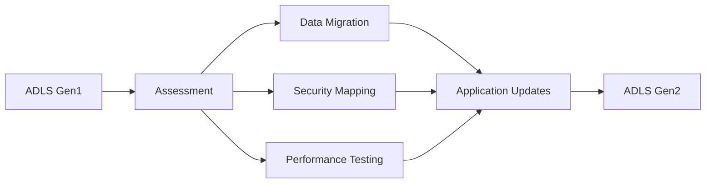

# Azure Data Lake Storage (ADLS) - Comprehensive Guide
## Complete Guide with Examples and Best Practices

---

### Table of Contents

1. [Introduction to Azure Data Lake Storage](#introduction-to-azure-data-lake-storage)
2. [ADLS Gen1 vs Gen2 Comparison](#adls-gen1-vs-gen2-comparison)
3. [Architecture and Components](#architecture-and-components)
4. [Getting Started with ADLS Gen2](#getting-started-with-adls-gen2)
5. [Storage Account Setup](#storage-account-setup)
6. [Hierarchical Namespace](#hierarchical-namespace)
7. [Data Organization Strategies](#data-organization-strategies)
8. [Access Control and Security](#access-control-and-security)
9. [Data Ingestion Methods](#data-ingestion-methods)
10. [Integration with Azure Services](#integration-with-azure-services)
11. [Performance Optimization](#performance-optimization)
12. [Cost Management](#cost-management)
13. [Monitoring and Diagnostics](#monitoring-and-diagnostics)
14. [Best Practices](#best-practices)
15. [Real-World Examples](#real-world-examples)
16. [Troubleshooting](#troubleshooting)
17. [Migration Strategies](#migration-strategies)
18. [Conclusion](#conclusion)

---

## Introduction to Azure Data Lake Storage

Azure Data Lake Storage (ADLS) is Microsoft's scalable and secure data lake solution for big data analytics workloads. It combines the power of a high-performance file system with massive scale and economy to help you reduce your time to insight.

### What is a Data Lake?

A **Data Lake** is a centralized repository that allows you to store all your structured and unstructured data at any scale. You can store your data as-is, without having to first structure the data, and run different types of analytics.

### Key Benefits of ADLS

- **Unlimited Scale**: Store exabytes of data with no limits on file sizes
- **High Performance**: Optimized for analytics workloads with high throughput
- **Security**: Enterprise-grade security with encryption and access controls
- **Cost-Effective**: Pay only for what you use with multiple storage tiers
- **Hadoop Compatible**: Works with existing Hadoop ecosystem tools
- **Multi-Protocol Support**: Supports both file system and object storage APIs

### ADLS Use Cases

```
Common Use Cases:
├── Big Data Analytics
│   ├── Batch Processing
│   ├── Real-time Analytics
│   └── Machine Learning
├── Data Warehousing
│   ├── ETL Pipelines
│   ├── Data Archival
│   └── Historical Analysis
├── IoT and Streaming
│   ├── Sensor Data
│   ├── Log Analytics
│   └── Time Series Data
└── Content Storage
    ├── Media Files
    ├── Documents
    └── Backup Storage
```

---

## ADLS Gen1 vs Gen2 Comparison

Azure Data Lake Storage has evolved through two generations, with Gen2 being the current recommended version.

### Feature Comparison

| Feature | ADLS Gen1 | ADLS Gen2 |
|---------|-----------|-----------|
| **Storage Foundation** | Dedicated Service | Azure Blob Storage |
| **Hierarchical Namespace** | Native | Optional (Recommended) |
| **Protocol Support** | WebHDFS | Blob REST, ABFS, HDFS |
| **Performance** | High | Higher |
| **Cost** | Higher | Lower |
| **Integration** | Limited | Extensive |
| **Security** | ACLs + RBAC | ACLs + RBAC + More |
| **Availability** | Limited Regions | Global |
| **Backup/DR** | Basic | Advanced |

### Migration Path



### Gen2 Advantages

- **Cost Optimization**: Up to 50% cost reduction compared to Gen1
- **Better Integration**: Native integration with Azure services
- **Multi-Protocol Access**: Support for both file and object storage APIs
- **Enhanced Security**: More granular access controls and encryption options
- **Global Availability**: Available in all Azure regions

---

## Architecture and Components

### ADLS Gen2 Architecture

```
ADLS Gen2 Architecture
├── Azure Storage Account
│   ├── Blob Service Endpoint
│   ├── Data Lake Service Endpoint (ABFS)
│   └── Hierarchical Namespace
├── Containers (File Systems)
│   ├── Directories
│   ├── Subdirectories
│   └── Files
├── Access Control
│   ├── RBAC (Role-Based Access Control)
│   ├── ACLs (Access Control Lists)
│   └── Shared Access Signatures
└── Integration Layer
    ├── Azure Data Factory
    ├── Azure Databricks
    ├── Azure Synapse Analytics
    └── HDInsight
```

### Core Components

#### 1. Storage Account
- **Foundation**: Built on Azure Blob Storage
- **Endpoints**: Multiple access endpoints (Blob, DFS, Web)
- **Replication**: Multiple redundancy options (LRS, ZRS, GRS, GZRS)

#### 2. Hierarchical Namespace
- **File System Structure**: Traditional file/folder hierarchy
- **Performance**: Optimized for analytics workloads
- **Compatibility**: POSIX-compliant permissions

#### 3. Containers (File Systems)
- **Organization**: Top-level organizational unit
- **Security Boundary**: Independent access control
- **Scalability**: Unlimited containers per account

---

## Getting Started with ADLS Gen2

### Prerequisites

- **Azure Subscription**: Active Azure subscription
- **Resource Group**: Existing or new resource group
- **Permissions**: Contributor or Owner role on the subscription/resource group

### Step 1: Create Storage Account via Azure Portal

1. **Navigate to Azure Portal** → Storage Accounts → Create
2. **Configure Basic Settings**:
   ```
   Subscription: Your-Subscription
   Resource Group: adls-demo-rg
   Storage Account Name: adlsdemostorage2024
   Region: East US 2
   Performance: Standard
   Redundancy: Locally Redundant Storage (LRS)
   ```

3. **Advanced Settings**:
   ```
   Security:
   ✓ Require secure transfer for REST API operations
   ✓ Enable blob public access
   ✓ Enable storage account key access
   ✓ Default to Azure Active Directory authorization
   
   Data Lake Storage Gen2:
   ✓ Enable hierarchical namespace
   
   Blob Storage:
   Access Tier: Hot
   ```

### Step 2: Create Storage Account via Azure CLI

```bash
# Create resource group
az group create --name adls-demo-rg --location eastus2

# Create storage account with hierarchical namespace
az storage account create \
    --name adlsdemostorage2024 \
    --resource-group adls-demo-rg \
    --location eastus2 \
    --sku Standard_LRS \
    --kind StorageV2 \
    --hierarchical-namespace true \
    --access-tier Hot

# Get storage account key
az storage account keys list \
    --resource-group adls-demo-rg \
    --account-name adlsdemostorage2024 \
    --output table
```

### Step 3: Create Storage Account via PowerShell

```powershell
# Set variables
$resourceGroupName = "adls-demo-rg"
$storageAccountName = "adlsdemostorage2024"
$location = "East US 2"

# Create resource group
New-AzResourceGroup -Name $resourceGroupName -Location $location

# Create storage account
$storageAccount = New-AzStorageAccount `
    -ResourceGroupName $resourceGroupName `
    -Name $storageAccountName `
    -Location $location `
    -SkuName "Standard_LRS" `
    -Kind "StorageV2" `
    -EnableHierarchicalNamespace $true `
    -AccessTier Hot

# Get storage context
$ctx = $storageAccount.Context

# Display connection information
Write-Host "Storage Account Created: $storageAccountName"
Write-Host "Primary Endpoint: $($storageAccount.PrimaryEndpoints.Dfs)"
```

### Step 4: Create File System (Container)

```bash
# Create file systems using Azure CLI
az storage fs create \
    --name raw-data \
    --account-name adlsdemostorage2024 \
    --auth-mode login

az storage fs create \
    --name processed-data \
    --account-name adlsdemostorage2024 \
    --auth-mode login

az storage fs create \
    --name curated-data \
    --account-name adlsdemostorage2024 \
    --auth-mode login
```

```powershell
# Create file systems using PowerShell
New-AzDataLakeGen2FileSystem -Context $ctx -Name "raw-data"
New-AzDataLakeGen2FileSystem -Context $ctx -Name "processed-data"
New-AzDataLakeGen2FileSystem -Context $ctx -Name "curated-data"
```

---

## Storage Account Setup

### Detailed Configuration Options

#### Performance Tiers

```
Performance Tiers:
├── Standard
│   ├── Use Case: General purpose workloads
│   ├── Storage Types: HDD-based
│   ├── Max IOPS: 20,000
│   └── Cost: Lower
└── Premium
    ├── Use Case: High-performance workloads
    ├── Storage Types: SSD-based
    ├── Max IOPS: 100,000+
    └── Cost: Higher
```

#### Redundancy Options

```
Redundancy Options:
├── Locally Redundant Storage (LRS)
│   ├── Copies: 3 within single datacenter
│   ├── Durability: 99.999999999% (11 9's)
│   └── Use Case: Cost-sensitive, non-critical data
├── Zone Redundant Storage (ZRS)
│   ├── Copies: 3 across availability zones
│   ├── Durability: 99.9999999999% (12 9's)
│   └── Use Case: High availability requirements
├── Geo Redundant Storage (GRS)
│   ├── Copies: 6 (3 local + 3 in paired region)
│   ├── Durability: 99.99999999999999% (16 9's)
│   └── Use Case: Disaster recovery requirements
└── Geo Zone Redundant Storage (GZRS)
    ├── Copies: 6 across zones and regions
    ├── Durability: 99.99999999999999% (16 9's)
    └── Use Case: Maximum durability and availability
```

### Access Tiers

```
Access Tiers:
├── Hot
│   ├── Use Case: Frequently accessed data
│   ├── Storage Cost: Higher
│   ├── Access Cost: Lower
│   └── Availability: 99.9%
├── Cool
│   ├── Use Case: Infrequently accessed (30+ days)
│   ├── Storage Cost: Lower
│   ├── Access Cost: Higher
│   └── Availability: 99%
└── Archive
    ├── Use Case: Rarely accessed (180+ days)
    ├── Storage Cost: Lowest
    ├── Access Cost: Highest
    └── Rehydration: Required before access
```

### Advanced Security Configuration

```json
{
  "properties": {
    "supportsHttpsTrafficOnly": true,
    "minimumTlsVersion": "TLS1_2",
    "allowBlobPublicAccess": false,
    "allowSharedKeyAccess": true,
    "defaultToOAuthAuthentication": true,
    "publicNetworkAccess": "Enabled",
    "allowCrossTenantReplication": false,
    "networkAcls": {
      "bypass": "AzureServices",
      "defaultAction": "Allow",
      "ipRules": [],
      "virtualNetworkRules": []
    },
    "encryption": {
      "services": {
        "file": {
          "keyType": "Account",
          "enabled": true
        },
        "blob": {
          "keyType": "Account",
          "enabled": true
        }
      },
      "keySource": "Microsoft.Storage"
    }
  }
}
```

---

## Hierarchical Namespace

### Understanding Hierarchical Namespace

The **Hierarchical Namespace** is the key feature that differentiates ADLS Gen2 from regular Blob Storage. It provides:

- **File System Semantics**: Traditional file/folder structure
- **POSIX Compliance**: Standard file system permissions
- **Atomic Operations**: Directory-level operations are atomic
- **Performance**: Optimized for analytics workloads

### Directory Structure Examples

#### Recommended Data Lake Structure

```
adls-demo-storage/
├── raw-data/                          # Landing zone for raw data
│   ├── sales/
│   │   ├── year=2024/
│   │   │   ├── month=01/
│   │   │   │   ├── day=01/
│   │   │   │   │   └── sales_20240101.csv
│   │   │   │   ├── day=02/
│   │   │   │   └── day=03/
│   │   │   ├── month=02/
│   │   │   └── month=03/
│   │   └── year=2023/
│   ├── customers/
│   │   ├── full_extract/
│   │   │   └── customers_20240101.json
│   │   └── incremental/
│   │       ├── 2024/01/01/
│   │       └── 2024/01/02/
│   └── products/
│       ├── catalog/
│       └── inventory/
├── processed-data/                     # Cleaned and validated data
│   ├── sales/
│   │   ├── cleaned/
│   │   │   └── sales_clean_2024.parquet
│   │   └── aggregated/
│   │       ├── daily/
│   │       ├── weekly/
│   │       └── monthly/
│   ├── customers/
│   │   ├── profiles/
│   │   └── segments/
│   └── products/
│       ├── enriched/
│       └── categorized/
├── curated-data/                       # Business-ready datasets
│   ├── sales_mart/
│   │   ├── fact_sales/
│   │   ├── dim_customer/
│   │   ├── dim_product/
│   │   └── dim_time/
│   ├── customer_mart/
│   │   ├── customer_360/
│   │   ├── customer_segments/
│   │   └── customer_lifetime_value/
│   └── product_mart/
│       ├── product_performance/
│       ├── inventory_analysis/
│       └── pricing_optimization/
└── archive/                           # Historical data
    ├── 2023/
    ├── 2022/
    └── 2021/
```

### Directory Operations

#### Creating Directory Structure

```bash
# Using Azure CLI
az storage fs directory create \
    --name "raw-data/sales/year=2024/month=01" \
    --file-system raw-data \
    --account-name adlsdemostorage2024 \
    --auth-mode login

az storage fs directory create \
    --name "processed-data/sales/cleaned" \
    --file-system processed-data \
    --account-name adlsdemostorage2024 \
    --auth-mode login

az storage fs directory create \
    --name "curated-data/sales_mart/fact_sales" \
    --file-system curated-data \
    --account-name adlsdemostorage2024 \
    --auth-mode login
```

```powershell
# Using PowerShell
$ctx = New-AzStorageContext -StorageAccountName "adlsdemostorage2024" -UseConnectedAccount

# Create directory structure
New-AzDataLakeGen2Item -Context $ctx -FileSystem "raw-data" -Path "sales/year=2024/month=01" -Directory
New-AzDataLakeGen2Item -Context $ctx -FileSystem "processed-data" -Path "sales/cleaned" -Directory
New-AzDataLakeGen2Item -Context $ctx -FileSystem "curated-data" -Path "sales_mart/fact_sales" -Directory
```

#### Python SDK Examples

```python
from azure.storage.filedatalake import DataLakeServiceClient

# Initialize client
service_client = DataLakeServiceClient(
    account_url="https://adlsdemostorage2024.dfs.core.windows.net",
    credential="your-credential"
)

# Get file system client
file_system_client = service_client.get_file_system_client(file_system="raw-data")

# Create directory
directory_client = file_system_client.create_directory("sales/year=2024/month=01")

# Create nested directories
directories = [
    "raw-data/sales/year=2024/month=01/day=01",
    "raw-data/sales/year=2024/month=01/day=02",
    "raw-data/customers/full_extract",
    "raw-data/customers/incremental/2024/01/01",
    "processed-data/sales/cleaned",
    "processed-data/sales/aggregated/daily",
    "curated-data/sales_mart/fact_sales"
]

for directory_path in directories:
    try:
        file_system_client.create_directory(directory_path)
        print(f"Created directory: {directory_path}")
    except Exception as e:
        print(f"Error creating {directory_path}: {e}")
```

---

## Data Organization Strategies

### Data Lake Zones

#### Zone-Based Architecture

```
Data Lake Zones:
├── Landing Zone (Raw)
│   ├── Purpose: Initial data ingestion
│   ├── Format: Native source format
│   ├── Schema: Schema-on-read
│   ├── Quality: No validation
│   └── Retention: 30-90 days
├── Bronze Zone (Raw)
│   ├── Purpose: Historical raw data
│   ├── Format: Optimized (Parquet/Delta)
│   ├── Schema: Inferred schema
│   ├── Quality: Basic validation
│   └── Retention: 2-7 years
├── Silver Zone (Processed)
│   ├── Purpose: Cleaned and enriched
│   ├── Format: Parquet/Delta Lake
│   ├── Schema: Defined schema
│   ├── Quality: Data quality rules
│   └── Retention: 1-5 years
└── Gold Zone (Curated)
    ├── Purpose: Business-ready datasets
    ├── Format: Optimized for consumption
    ├── Schema: Business schema
    ├── Quality: High quality, governed
    └── Retention: Long-term
```

### Partitioning Strategies

#### Time-Based Partitioning

```
Time-Based Partitioning:
/sales_data/
├── year=2024/
│   ├── month=01/
│   │   ├── day=01/
│   │   │   ├── hour=00/
│   │   │   │   └── sales_data_2024010100.parquet
│   │   │   ├── hour=01/
│   │   │   └── hour=02/
│   │   ├── day=02/
│   │   └── day=03/
│   ├── month=02/
│   └── month=03/
├── year=2023/
└── year=2022/
```

#### Multi-Dimensional Partitioning

```
Multi-Dimensional Partitioning:
/sales_data/
├── region=north_america/
│   ├── country=usa/
│   │   ├── state=california/
│   │   │   ├── year=2024/
│   │   │   │   ├── month=01/
│   │   │   │   └── month=02/
│   │   │   └── year=2023/
│   │   ├── state=texas/
│   │   └── state=florida/
│   └── country=canada/
├── region=europe/
└── region=asia_pacific/
```

### File Naming Conventions

#### Recommended Naming Standards

```
File Naming Convention:
{source}_{entity}_{date}_{sequence}.{format}

Examples:
├── Raw Data:
│   ├── salesforce_accounts_20240101_001.json
│   ├── erp_orders_20240101_001.csv
│   └── web_clickstream_20240101_143022.json
├── Processed Data:
│   ├── cleaned_customer_profiles_20240101.parquet
│   ├── enriched_product_catalog_20240101.parquet
│   └── aggregated_daily_sales_20240101.parquet
└── Curated Data:
    ├── dim_customer_20240101.parquet
    ├── fact_sales_20240101.parquet
    └── customer_360_view_20240101.parquet
```

#### Metadata in File Names

```
Metadata Encoding:
{domain}_{entity}_{processing_date}_{data_date}_{version}_{checksum}.{format}

Example:
finance_daily_sales_20240115_20240114_v001_abc123.parquet

Where:
- domain: finance
- entity: daily_sales
- processing_date: 20240115 (when processed)
- data_date: 20240114 (data period)
- version: v001
- checksum: abc123 (data integrity)
- format: parquet
```

---

## Access Control and Security

### Security Layers

```
ADLS Gen2 Security Layers:
├── Network Security
│   ├── Virtual Network Service Endpoints
│   ├── Private Endpoints
│   ├── Firewall Rules
│   └── IP Access Control Lists
├── Authentication
│   ├── Azure Active Directory
│   ├── Shared Access Signatures (SAS)
│   ├── Account Keys
│   └── Managed Identities
├── Authorization
│   ├── Role-Based Access Control (RBAC)
│   ├── Access Control Lists (ACLs)
│   └── Resource-Level Permissions
└── Data Protection
    ├── Encryption at Rest
    ├── Encryption in Transit
    ├── Customer-Managed Keys
    └── Data Loss Prevention
```

### Role-Based Access Control (RBAC)

#### Built-in Roles

```
RBAC Roles for ADLS:
├── Storage Account Level:
│   ├── Storage Account Contributor
│   ├── Storage Account Reader
│   └── Storage Account Key Operator Service Role
├── Data Level:
│   ├── Storage Blob Data Owner
│   ├── Storage Blob Data Contributor
│   ├── Storage Blob Data Reader
│   └── Storage Blob Delegator
└── Custom Roles:
    ├── Data Lake Administrator
    ├── Data Lake Reader
    └── Data Lake Contributor
```

#### RBAC Assignment Examples

```bash
# Assign Storage Blob Data Contributor role
az role assignment create \
    --role "Storage Blob Data Contributor" \
    --assignee user@domain.com \
    --scope "/subscriptions/{subscription-id}/resourceGroups/adls-demo-rg/providers/Microsoft.Storage/storageAccounts/adlsdemostorage2024"

# Assign role at container level
az role assignment create \
    --role "Storage Blob Data Reader" \
    --assignee group-object-id \
    --scope "/subscriptions/{subscription-id}/resourceGroups/adls-demo-rg/providers/Microsoft.Storage/storageAccounts/adlsdemostorage2024/blobServices/default/containers/raw-data"
```

### Access Control Lists (ACLs)

#### ACL Types

```
ACL Types:
├── Access ACLs
│   ├── Applied to: Files and directories
│   ├── Purpose: Control access to objects
│   └── Inheritance: Not inherited
└── Default ACLs
    ├── Applied to: Directories only
    ├── Purpose: Template for child objects
    └── Inheritance: Inherited by children
```

#### ACL Permissions

```
ACL Permissions:
├── Read (r): Read file content or list directory
├── Write (w): Write to file or create/delete in directory
├── Execute (x): Execute file or traverse directory
└── Combinations:
    ├── rwx: Full access
    ├── r-x: Read and execute
    ├── r--: Read only
    └── ---: No access
```

#### Setting ACLs

```bash
# Set ACL on directory
az storage fs access set \
    --acl "user::rwx,group::r-x,other::---,user:john@domain.com:rwx" \
    --path "sales/year=2024" \
    --file-system raw-data \
    --account-name adlsdemostorage2024 \
    --auth-mode login

# Set default ACL on directory
az storage fs access set \
    --acl "default:user::rwx,default:group::r-x,default:other::---,default:user:john@domain.com:rwx" \
    --path "sales/year=2024" \
    --file-system raw-data \
    --account-name adlsdemostorage2024 \
    --auth-mode login

# Set ACL recursively
az storage fs access set-recursive \
    --acl "user::rwx,group::r-x,other::---" \
    --path "sales" \
    --file-system raw-data \
    --account-name adlsdemostorage2024 \
    --auth-mode login
```

### Network Security

#### Private Endpoints

```json
{
  "privateEndpoint": {
    "name": "adls-private-endpoint",
    "location": "East US 2",
    "properties": {
      "subnet": {
        "id": "/subscriptions/{subscription-id}/resourceGroups/{rg-name}/providers/Microsoft.Network/virtualNetworks/{vnet-name}/subnets/{subnet-name}"
      },
      "privateLinkServiceConnections": [
        {
          "name": "adls-connection",
          "properties": {
            "privateLinkServiceId": "/subscriptions/{subscription-id}/resourceGroups/adls-demo-rg/providers/Microsoft.Storage/storageAccounts/adlsdemostorage2024",
            "groupIds": ["dfs"],
            "requestMessage": "Please approve connection"
          }
        }
      ]
    }
  }
}
```

#### Firewall Rules

```bash
# Add IP firewall rule
az storage account network-rule add \
    --resource-group adls-demo-rg \
    --account-name adlsdemostorage2024 \
    --ip-address 203.0.113.0/24

# Add virtual network rule
az storage account network-rule add \
    --resource-group adls-demo-rg \
    --account-name adlsdemostorage2024 \
    --vnet-name myVnet \
    --subnet mySubnet

# Set default action to deny
az storage account update \
    --resource-group adls-demo-rg \
    --name adlsdemostorage2024 \
    --default-action Deny
```

---

## Data Ingestion Methods

### Ingestion Patterns

```
Data Ingestion Patterns:
├── Batch Ingestion
│   ├── Scheduled ETL Jobs
│   ├── Bulk Data Loads
│   └── File-based Transfers
├── Stream Ingestion
│   ├── Real-time Event Streams
│   ├── IoT Data Streams
│   └── Log Streaming
├── Micro-batch Ingestion
│   ├── Small, frequent batches
│   ├── Near real-time processing
│   └── Delta Lake integration
└── API-based Ingestion
    ├── REST API calls
    ├── Webhook integrations
    └── Third-party connectors
```

### Azure Data Factory Integration

#### Copy Activity Example

```json
{
  "name": "CopyFromSQLToADLS",
  "type": "Copy",
  "inputs": [
    {
      "referenceName": "SqlServerDataset",
      "type": "DatasetReference"
    }
  ],
  "outputs": [
    {
      "referenceName": "ADLSDataset",
      "type": "DatasetReference",
      "parameters": {
        "folderPath": "raw-data/sales/year=2024/month=01/day=15",
        "fileName": "sales_20240115.parquet"
      }
    }
  ],
  "typeProperties": {
    "source": {
      "type": "SqlSource",
      "sqlReaderQuery": "SELECT * FROM Sales WHERE ModifiedDate >= '2024-01-15'"
    },
    "sink": {
      "type": "ParquetSink",
      "storeSettings": {
        "type": "AzureBlobFSWriteSettings",
        "maxConcurrentConnections": 10,
        "blockSizeInMB": 100
      },
      "formatSettings": {
        "type": "ParquetWriteSettings",
        "compressionCodec": "snappy"
      }
    },
    "enableStaging": false,
    "parallelCopies": 4,
    "dataIntegrationUnits": 8
  }
}
```

#### Data Flow Example

```json
{
  "name": "TransformSalesData",
  "type": "MappingDataFlow",
  "typeProperties": {
    "sources": [
      {
        "dataset": {
          "referenceName": "RawSalesData",
          "type": "DatasetReference"
        },
        "name": "RawSales"
      }
    ],
    "sinks": [
      {
        "dataset": {
          "referenceName": "ProcessedSalesData",
          "type": "DatasetReference"
        },
        "name": "ProcessedSales"
      }
    ],
    "transformations": [
      {
        "name": "FilterValidRecords",
        "type": "Filter",
        "typeProperties": {
          "condition": {
            "value": "!isNull(CustomerID) && Amount > 0",
            "type": "Expression"
          }
        }
      },
      {
        "name": "DeriveCalculatedFields",
        "type": "DerivedColumn",
        "typeProperties": {
          "columns": [
            {
              "name": "TaxAmount",
              "expression": {
                "value": "Amount * 0.08",
                "type": "Expression"
              }
            },
            {
              "name": "TotalAmount",
              "expression": {
                "value": "Amount + TaxAmount",
                "type": "Expression"
              }
            }
          ]
        }
      }
    ]
  }
}
```

### Azure Stream Analytics

#### Stream to ADLS Example

```sql
-- Stream Analytics Query
WITH FilteredEvents AS (
    SELECT 
        EventId,
        UserId,
        EventType,
        EventData,
        EventTimestamp,
        System.Timestamp() AS ProcessingTime
    FROM InputStream
    WHERE EventType IN ('purchase', 'view', 'click')
)

SELECT 
    EventId,
    UserId,
    EventType,
    EventData,
    EventTimestamp,
    ProcessingTime,
    DATEPART(year, EventTimestamp) AS Year,
    DATEPART(month, EventTimestamp) AS Month,
    DATEPART(day, EventTimestamp) AS Day,
    DATEPART(hour, EventTimestamp) AS Hour
INTO ADLSOutput
FROM FilteredEvents
```

### Event Hubs Integration

#### Real-time Data Ingestion

```python
import asyncio
from azure.eventhub import EventHubProducerClient, EventData
from azure.storage.filedatalake import DataLakeServiceClient
import json
from datetime import datetime

class EventHubToADLSProcessor:
    def __init__(self, eventhub_connection_string, eventhub_name, 
                 adls_account_url, adls_credential):
        self.producer = EventHubProducerClient.from_connection_string(
            conn_str=eventhub_connection_string,
            eventhub_name=eventhub_name
        )
        self.adls_client = DataLakeServiceClient(
            account_url=adls_account_url,
            credential=adls_credential
        )
    
    async def process_events(self, events):
        # Group events by hour for batch writing
        event_groups = {}
        
        for event in events:
            event_time = datetime.fromisoformat(event['timestamp'])
            hour_key = event_time.strftime('%Y/%m/%d/%H')
            
            if hour_key not in event_groups:
                event_groups[hour_key] = []
            event_groups[hour_key].append(event)
        
        # Write each group to ADLS
        for hour_key, hour_events in event_groups.items():
            await self.write_to_adls(hour_key, hour_events)
    
    async def write_to_adls(self, hour_key, events):
        file_system_name = "streaming-data"
        file_path = f"events/year={hour_key.split('/')[0]}/month={hour_key.split('/')[1]}/day={hour_key.split('/')[2]}/hour={hour_key.split('/')[3]}/events_{datetime.now().strftime('%Y%m%d%H%M%S')}.json"
        
        file_system_client = self.adls_client.get_file_system_client(file_system_name)
        file_client = file_system_client.get_file_client(file_path)
        
        # Convert events to JSON Lines format
        json_lines = '\n'.join([json.dumps(event) for event in events])
        
        await file_client.upload_data(
            data=json_lines,
            overwrite=True,
            content_settings={'content_type': 'application/json'}
        )
        
        print(f"Uploaded {len(events)} events to {file_path}")
```

### Azure Databricks Integration

#### Mount ADLS in Databricks

```python
# Mount ADLS Gen2 in Databricks
configs = {
    "fs.azure.account.auth.type": "OAuth",
    "fs.azure.account.oauth.provider.type": "org.apache.hadoop.fs.azurebfs.oauth2.ClientCredsTokenProvider",
    "fs.azure.account.oauth2.client.id": "<client-id>",
    "fs.azure.account.oauth2.client.secret": "<client-secret>",
    "fs.azure.account.oauth2.client.endpoint": "https://login.microsoftonline.com/<tenant-id>/oauth2/token"
}

dbutils.fs.mount(
    source = "abfss://raw-data@adlsdemostorage2024.dfs.core.windows.net/",
    mount_point = "/mnt/raw-data",
    extra_configs = configs
)

# Read data from ADLS
df = spark.read.format("parquet").load("/mnt/raw-data/sales/year=2024/month=01/")

# Transform data
transformed_df = df.filter(df.Amount > 0) \
                   .withColumn("TaxAmount", df.Amount * 0.08) \
                   .withColumn("TotalAmount", df.Amount + df.TaxAmount)

# Write back to ADLS
transformed_df.write \
              .mode("overwrite") \
              .partitionBy("Year", "Month") \
              .parquet("/mnt/processed-data/sales/cleaned/")
```

---

## Integration with Azure Services

### Azure Synapse Analytics

#### External Tables on ADLS

```sql
-- Create external data source
CREATE EXTERNAL DATA SOURCE ADLSDataSource
WITH (
    TYPE = HADOOP,
    LOCATION = 'abfss://curated-data@adlsdemostorage2024.dfs.core.windows.net/',
    CREDENTIAL = ManagedIdentityCredential
);

-- Create external file format
CREATE EXTERNAL FILE FORMAT ParquetFileFormat
WITH (
    FORMAT_TYPE = PARQUET,
    DATA_COMPRESSION = 'org.apache.hadoop.io.compress.SnappyCodec'
);

-- Create external table
CREATE EXTERNAL TABLE ext_SalesData (
    SaleId BIGINT,
    CustomerId INT,
    ProductId INT,
    SaleDate DATE,
    Amount DECIMAL(10,2),
    Quantity INT,
    Region NVARCHAR(50)
)
WITH (
    LOCATION = '/sales_mart/fact_sales/',
    DATA_SOURCE = ADLSDataSource,
    FILE_FORMAT = ParquetFileFormat
);

-- Query external table
SELECT 
    Region,
    YEAR(SaleDate) as SalesYear,
    COUNT(*) as TransactionCount,
    SUM(Amount) as TotalRevenue,
    AVG(Amount) as AverageTransactionValue
FROM ext_SalesData
WHERE SaleDate >= '2024-01-01'
GROUP BY Region, YEAR(SaleDate)
ORDER BY TotalRevenue DESC;
```

#### Serverless SQL Pool Queries

```sql
-- Direct query without external table
SELECT TOP 100 *
FROM OPENROWSET(
    BULK 'https://adlsdemostorage2024.dfs.core.windows.net/raw-data/sales/year=2024/month=01/**/*.parquet',
    FORMAT = 'PARQUET'
) AS sales_data;

-- Aggregated query with partitioning
SELECT 
    YEAR(SaleDate) as SalesYear,
    MONTH(SaleDate) as SalesMonth,
    Region,
    COUNT(*) as TransactionCount,
    SUM(Amount) as TotalRevenue
FROM OPENROWSET(
    BULK 'https://adlsdemostorage2024.dfs.core.windows.net/raw-data/sales/year=2024/**/*.parquet',
    FORMAT = 'PARQUET'
) AS sales_data
GROUP BY YEAR(SaleDate), MONTH(SaleDate), Region
ORDER BY SalesYear, SalesMonth, TotalRevenue DESC;
```

### Power BI Integration

#### Direct Query to ADLS

```powerquery
let
    Source = AzureStorage.DataLake("https://adlsdemostorage2024.dfs.core.windows.net/curated-data/sales_mart/"),
    #"Navigation 1" = Source{[Name="fact_sales"]}[Data],
    #"Navigation 2" = #"Navigation 1"{[Name="part-00000-*.parquet"]}[Data],
    #"Promoted Headers" = Table.PromoteHeaders(#"Navigation 2", [PromoteAllScalars=true]),
    #"Changed Type" = Table.TransformColumnTypes(#"Promoted Headers",{
        {"SaleId", Int64.Type},
        {"CustomerId", Int64.Type},
        {"ProductId", Int64.Type},
        {"SaleDate", type date},
        {"Amount", type number},
        {"Quantity", Int64.Type},
        {"Region", type text}
    })
in
    #"Changed Type"
```

### Azure Machine Learning

#### Dataset Registration

```python
from azureml.core import Workspace, Dataset
from azureml.core.datastore import Datastore

# Connect to workspace
ws = Workspace.from_config()

# Register ADLS as datastore
adls_datastore = Datastore.register_azure_data_lake_gen2(
    workspace=ws,
    datastore_name='adls_datastore',
    account_name='adlsdemostorage2024',
    filesystem='curated-data',
    tenant_id='your-tenant-id',
    client_id='your-client-id',
    client_secret='your-client-secret'
)

# Create dataset from ADLS path
dataset = Dataset.Tabular.from_delimited_files(
    path=[(adls_datastore, 'sales_mart/fact_sales/*.parquet')],
    separator=',',
    header=True
)

# Register dataset
dataset = dataset.register(
    workspace=ws,
    name='sales_data',
    description='Sales transaction data from ADLS',
    tags={'source': 'adls', 'format': 'parquet'},
    create_new_version=True
)
```

### HDInsight Integration

#### Spark on HDInsight

```scala
// Scala code for Spark on HDInsight
import org.apache.spark.sql.SparkSession

val spark = SparkSession.builder()
  .appName("ADLS Processing")
  .getOrCreate()

// Configure ADLS access
spark.conf.set("fs.azure.account.auth.type.adlsdemostorage2024.dfs.core.windows.net", "OAuth")
spark.conf.set("fs.azure.account.oauth.provider.type.adlsdemostorage2024.dfs.core.windows.net", 
  "org.apache.hadoop.fs.azurebfs.oauth2.ClientCredsTokenProvider")
spark.conf.set("fs.azure.account.oauth2.client.id.adlsdemostorage2024.dfs.core.windows.net", "client-id")
spark.conf.set("fs.azure.account.oauth2.client.secret.adlsdemostorage2024.dfs.core.windows.net", "client-secret")
spark.conf.set("fs.azure.account.oauth2.client.endpoint.adlsdemostorage2024.dfs.core.windows.net", 
  "https://login.microsoftonline.com/tenant-id/oauth2/token")

// Read data from ADLS
val rawData = spark.read
  .option("header", "true")
  .option("inferSchema", "true")
  .parquet("abfss://raw-data@adlsdemostorage2024.dfs.core.windows.net/sales/year=2024/")

// Process data
val processedData = rawData
  .filter($"Amount" > 0)
  .withColumn("TaxAmount", $"Amount" * 0.08)
  .withColumn("TotalAmount", $"Amount" + $"TaxAmount")
  .groupBy("Region", "ProductCategory")
  .agg(
    sum("TotalAmount").alias("TotalRevenue"),
    count("SaleId").alias("TransactionCount"),
    avg("TotalAmount").alias("AverageTransaction")
  )

// Write results back to ADLS
processedData.write
  .mode("overwrite")
  .partitionBy("Region")
  .parquet("abfss://processed-data@adlsdemostorage2024.dfs.core.windows.net/sales/aggregated/")
```

---

## Performance Optimization

### File Format Optimization

#### Format Comparison

| Format | Use Case | Compression | Query Performance | Write Performance | Schema Evolution |
|--------|----------|-------------|------------------|-------------------|------------------|
| **CSV** | Data ingestion | Poor | Poor | Good | Limited |
| **JSON** | Semi-structured | Poor | Poor | Good | Excellent |
| **Parquet** | Analytics | Excellent | Excellent | Good | Good |
| **ORC** | Hadoop ecosystem | Excellent | Excellent | Good | Good |
| **Delta Lake** | ACID requirements | Excellent | Excellent | Excellent | Excellent |
| **Avro** | Schema evolution | Good | Good | Excellent | Excellent |

#### Parquet Optimization

```python
# Optimized Parquet writing in Python
import pandas as pd
import pyarrow as pa
import pyarrow.parquet as pq
from azure.storage.filedatalake import DataLakeServiceClient

# Configure Parquet settings
parquet_schema = pa.schema([
    pa.field('sale_id', pa.int64()),
    pa.field('customer_id', pa.int32()),
    pa.field('product_id', pa.int32()),
    pa.field('sale_date', pa.date32()),
    pa.field('amount', pa.decimal128(10, 2)),
    pa.field('region', pa.string())
])

# Write optimized Parquet
table = pa.Table.from_pandas(df, schema=parquet_schema)

# Write with optimal settings
pq.write_table(
    table,
    'sales_data.parquet',
    compression='snappy',  # Good balance of speed and compression
    row_group_size=100000,  # Optimize for query patterns
    use_dictionary=True,    # Enable dictionary encoding
    write_statistics=True   # Enable column statistics
)
```

### Partitioning Strategies

#### Optimal Partition Size

```
Partition Size Guidelines:
├── File Size: 100MB - 1GB per file
├── Row Count: 1M - 10M rows per file
├── Partition Count: < 10,000 partitions
└── Partition Depth: < 5 levels deep
```

#### Dynamic Partitioning Example

```python
def write_partitioned_data(df, base_path, partition_cols):
    """
    Write DataFrame with optimal partitioning
    """
    # Calculate optimal file size
    total_size = df.memory_usage(deep=True).sum()
    target_file_size = 500 * 1024 * 1024  # 500MB target
    num_files = max(1, total_size // target_file_size)
    
    # Repartition data
    df_repartitioned = df.repartition(num_files, *partition_cols)
    
    # Write with partitioning
    df_repartitioned.write \
        .mode("overwrite") \
        .partitionBy(*partition_cols) \
        .option("maxRecordsPerFile", 10000000) \
        .parquet(base_path)
```

### Caching Strategies

#### Delta Lake Caching

```sql
-- Cache frequently accessed tables
CACHE TABLE sales_data_cached AS
SELECT * FROM delta.`/curated-data/sales_mart/fact_sales/`
WHERE sale_date >= current_date() - INTERVAL 30 DAYS;

-- Optimize table for better performance
OPTIMIZE delta.`/curated-data/sales_mart/fact_sales/`
ZORDER BY (customer_id, product_id);

-- Vacuum old files
VACUUM delta.`/curated-data/sales_mart/fact_sales/` RETAIN 168 HOURS;
```

### Query Optimization

#### Predicate Pushdown

```python
# Efficient query with predicate pushdown
df = spark.read.parquet("abfss://raw-data@adlsdemostorage2024.dfs.core.windows.net/sales/") \
    .filter(col("sale_date") >= "2024-01-01") \
    .filter(col("region") == "North America") \
    .select("customer_id", "product_id", "amount", "sale_date")

# Avoid - reads all data first
df_inefficient = spark.read.parquet("abfss://raw-data@adlsdemostorage2024.dfs.core.windows.net/sales/") \
    .select("customer_id", "product_id", "amount", "sale_date") \
    .filter(col("sale_date") >= "2024-01-01") \
    .filter(col("region") == "North America")
```

---

## Cost Management

### Storage Cost Optimization

#### Storage Tiers and Lifecycle Management

```json
{
  "rules": [
    {
      "name": "MoveToArchive",
      "enabled": true,
      "type": "Lifecycle",
      "definition": {
        "filters": {
          "blobTypes": ["blockBlob"],
          "prefixMatch": ["archive/", "raw-data/year=2022/"]
        },
        "actions": {
          "baseBlob": {
            "tierToArchive": {
              "daysAfterModificationGreaterThan": 365
            },
            "delete": {
              "daysAfterModificationGreaterThan": 2555
            }
          }
        }
      }
    },
    {
      "name": "MoveToCool",
      "enabled": true,
      "type": "Lifecycle",
      "definition": {
        "filters": {
          "blobTypes": ["blockBlob"],
          "prefixMatch": ["processed-data/", "raw-data/year=2023/"]
        },
        "actions": {
          "baseBlob": {
            "tierToCool": {
              "daysAfterModificationGreaterThan": 30
            },
            "tierToArchive": {
              "daysAfterModificationGreaterThan": 180
            }
          }
        }
      }
    }
  ]
}
```

### Cost Monitoring

#### Cost Analysis Query

```sql
-- Cost analysis for ADLS usage
SELECT 
    DATE_TRUNC('month', usage_date) as month,
    resource_group,
    meter_category,
    meter_subcategory,
    SUM(quantity) as total_quantity,
    SUM(cost) as total_cost,
    AVG(cost / quantity) as avg_unit_cost
FROM azure_cost_management.usage_details
WHERE resource_type = 'Microsoft.Storage/storageAccounts'
  AND meter_category = 'Storage'
  AND usage_date >= DATE_SUB(CURRENT_DATE(), INTERVAL 12 MONTH)
GROUP BY 1, 2, 3, 4
ORDER BY month DESC, total_cost DESC;
```

#### Cost Optimization Recommendations

```
Cost Optimization Strategies:
├── Data Lifecycle Management
│   ├── Implement lifecycle policies
│   ├── Move old data to cool/archive tiers
│   └── Delete unnecessary data
├── File Format Optimization
│   ├── Use compressed formats (Parquet, ORC)
│   ├── Optimize file sizes (100MB-1GB)
│   └── Remove duplicate data
├── Access Pattern Optimization
│   ├── Partition by access patterns
│   ├── Use appropriate access tiers
│   └── Minimize data movement
└── Monitoring and Alerting
    ├── Set up cost alerts
    ├── Monitor usage patterns
    └── Regular cost reviews
```

---

## Monitoring and Diagnostics

### Azure Monitor Integration

#### Metrics to Monitor

```
Key ADLS Metrics:
├── Capacity Metrics
│   ├── Used Capacity
│   ├── Container Count
│   └── Object Count
├── Transaction Metrics
│   ├── Transactions per second
│   ├── Success rate
│   ├── Error rate
│   └── Latency (E2E, Server)
├── Ingress/Egress
│   ├── Data ingress
│   ├── Data egress
│   └── Bandwidth utilization
└── Availability
    ├── Service availability
    ├── Error types
    └── Response times
```

#### Diagnostic Settings

```json
{
  "properties": {
    "storageAccountId": "/subscriptions/{subscription-id}/resourceGroups/adls-demo-rg/providers/Microsoft.Storage/storageAccounts/adlsdemostorage2024",
    "logs": [
      {
        "category": "StorageRead",
        "enabled": true,
        "retentionPolicy": {
          "enabled": true,
          "days": 30
        }
      },
      {
        "category": "StorageWrite",
        "enabled": true,
        "retentionPolicy": {
          "enabled": true,
          "days": 30
        }
      },
      {
        "category": "StorageDelete",
        "enabled": true,
        "retentionPolicy": {
          "enabled": true,
          "days": 90
        }
      }
    ],
    "metrics": [
      {
        "category": "Transaction",
        "enabled": true,
        "retentionPolicy": {
          "enabled": true,
          "days": 30
        }
      },
      {
        "category": "Capacity",
        "enabled": true,
        "retentionPolicy": {
          "enabled": true,
          "days": 30
        }
      }
    ]
  }
}
```

### Log Analytics Queries

#### Performance Analysis

```kusto
// Query to analyze ADLS performance
StorageBlobLogs
| where TimeGenerated > ago(24h)
| where AccountName == "adlsdemostorage2024"
| summarize 
    RequestCount = count(),
    AvgE2ELatency = avg(DurationMs),
    MaxE2ELatency = max(DurationMs),
    SuccessRate = countif(StatusCode < 400) * 100.0 / count()
    by bin(TimeGenerated, 1h), OperationName
| render timechart
```

#### Error Analysis

```kusto
// Query to analyze errors
StorageBlobLogs
| where TimeGenerated > ago(7d)
| where AccountName == "adlsdemostorage2024"
| where StatusCode >= 400
| summarize ErrorCount = count() by StatusCode, StatusText, OperationName
| order by ErrorCount desc
```

### Custom Monitoring Solutions

#### Python Monitoring Script

```python
import json
from azure.monitor.query import LogsQueryClient, MetricsQueryClient
from azure.identity import DefaultAzureCredential
from datetime import datetime, timedelta

class ADLSMonitor:
    def __init__(self, subscription_id, resource_group, storage_account):
        self.credential = DefaultAzureCredential()
        self.logs_client = LogsQueryClient(self.credential)
        self.metrics_client = MetricsQueryClient(self.credential)
        self.resource_id = f"/subscriptions/{subscription_id}/resourceGroups/{resource_group}/providers/Microsoft.Storage/storageAccounts/{storage_account}"
    
    def get_capacity_metrics(self):
        """Get storage capacity metrics"""
        end_time = datetime.now()
        start_time = end_time - timedelta(days=1)
        
        response = self.metrics_client.query_resource(
            resource_uri=self.resource_id,
            metric_names=["UsedCapacity"],
            timespan=(start_time, end_time),
            granularity=timedelta(hours=1)
        )
        
        metrics = []
        for metric in response.metrics:
            for time_series in metric.timeseries:
                for data_point in time_series.data:
                    metrics.append({
                        'timestamp': data_point.timestamp,
                        'capacity_bytes': data_point.total,
                        'capacity_gb': data_point.total / (1024**3) if data_point.total else 0
                    })
        
        return metrics
    
    def get_transaction_metrics(self):
        """Get transaction metrics"""
        end_time = datetime.now()
        start_time = end_time - timedelta(hours=24)
        
        response = self.metrics_client.query_resource(
            resource_uri=self.resource_id,
            metric_names=["Transactions", "SuccessE2ELatency", "Availability"],
            timespan=(start_time, end_time),
            granularity=timedelta(minutes=15)
        )
        
        return response
    
    def check_health(self):
        """Perform health check"""
        health_status = {
            'timestamp': datetime.now().isoformat(),
            'status': 'healthy',
            'issues': []
        }
        
        # Check capacity
        capacity_metrics = self.get_capacity_metrics()
        if capacity_metrics:
            latest_capacity = capacity_metrics[-1]['capacity_gb']
            if latest_capacity > 1000:  # 1TB threshold
                health_status['issues'].append(f"High capacity usage: {latest_capacity:.2f} GB")
        
        # Check transaction metrics
        transaction_metrics = self.get_transaction_metrics()
        # Add transaction analysis logic here
        
        if health_status['issues']:
            health_status['status'] = 'warning'
        
        return health_status

# Usage
monitor = ADLSMonitor('subscription-id', 'adls-demo-rg', 'adlsdemostorage2024')
health = monitor.check_health()
print(json.dumps(health, indent=2))
```

---

## Best Practices

### Data Organization Best Practices

#### 1. Implement Data Lake Zones

```
Recommended Zone Structure:
├── Landing (Raw)
│   ├── Retention: 30-90 days
│   ├── Format: Source format
│   ├── Schema: None
│   └── Quality: No validation
├── Bronze (Raw Historical)
│   ├── Retention: 2-7 years
│   ├── Format: Parquet/Delta
│   ├── Schema: Inferred
│   └── Quality: Basic validation
├── Silver (Processed)
│   ├── Retention: 1-5 years
│   ├── Format: Parquet/Delta
│   ├── Schema: Defined
│   └── Quality: Business rules
└── Gold (Curated)
    ├── Retention: Long-term
    ├── Format: Optimized
    ├── Schema: Business schema
    └── Quality: High quality
```

#### 2. Naming Conventions

```
Naming Standards:
├── Storage Account: {org}{env}{region}{purpose}{seq}
│   └── Example: contosoprodeus2datalake01
├── Container: {purpose}-{environment}
│   └── Example: raw-data-prod, processed-data-dev
├── Directory: {domain}/{entity}/{partition_structure}
│   └── Example: sales/transactions/year=2024/month=01
└── File: {source}_{entity}_{date}_{sequence}.{format}
    └── Example: erp_sales_20240115_001.parquet
```

### Security Best Practices

#### 1. Implement Defense in Depth

```
Security Layers:
├── Network Security
│   ├── Private endpoints
│   ├── Firewall rules
│   ├── VNet integration
│   └── NSG rules
├── Identity & Access
│   ├── Azure AD authentication
│   ├── RBAC assignments
│   ├── ACL permissions
│   └── Managed identities
├── Data Protection
│   ├── Encryption at rest
│   ├── Encryption in transit
│   ├── Customer-managed keys
│   └── Data classification
└── Monitoring & Compliance
    ├── Audit logging
    ├── Activity monitoring
    ├── Compliance reporting
    └── Threat detection
```

#### 2. Access Control Strategy

```python
# Example: Implement least privilege access
def setup_data_lake_security():
    security_groups = {
        'data-engineers': {
            'raw-data': ['read', 'write'],
            'processed-data': ['read', 'write'],
            'curated-data': ['read', 'write']
        },
        'data-scientists': {
            'processed-data': ['read'],
            'curated-data': ['read']
        },
        'business-analysts': {
            'curated-data': ['read']
        },
        'data-stewards': {
            'raw-data': ['read'],
            'processed-data': ['read', 'write'],
            'curated-data': ['read', 'write', 'admin']
        }
    }
    
    return security_groups
```

### Performance Best Practices

#### 1. File Size Optimization

```python
def optimize_file_sizes(df, target_size_mb=500):
    """
    Optimize file sizes for better query performance
    """
    # Calculate current size
    current_size_mb = df.memory_usage(deep=True).sum() / (1024**2)
    
    # Calculate optimal partition count
    optimal_partitions = max(1, int(current_size_mb / target_size_mb))
    
    # Repartition data
    optimized_df = df.repartition(optimal_partitions)
    
    return optimized_df
```

#### 2. Compression Strategy

```
Compression Guidelines:
├── Snappy: Good balance of speed and compression
├── GZIP: Better compression, slower
├── LZO: Fast compression and decompression
└── ZSTD: Modern, efficient compression
```

### Cost Optimization Best Practices

#### 1. Lifecycle Management

```json
{
  "lifecycle_policy": {
    "hot_tier": {
      "duration": "30 days",
      "use_case": "Active data processing"
    },
    "cool_tier": {
      "duration": "90 days", 
      "use_case": "Occasional access"
    },
    "archive_tier": {
      "duration": "365+ days",
      "use_case": "Long-term retention"
    }
  }
}
```

#### 2. Data Deduplication

```python
def deduplicate_data(df, key_columns):
    """
    Remove duplicate records to reduce storage costs
    """
    # Identify duplicates
    duplicates = df.groupBy(*key_columns).count().filter("count > 1")
    
    if duplicates.count() > 0:
        print(f"Found {duplicates.count()} duplicate groups")
        
        # Keep only the latest record for each key
        from pyspark.sql.window import Window
        from pyspark.sql.functions import row_number, desc
        
        window_spec = Window.partitionBy(*key_columns).orderBy(desc("last_modified"))
        deduplicated_df = df.withColumn("row_num", row_number().over(window_spec)) \
                           .filter("row_num = 1") \
                           .drop("row_num")
        
        return deduplicated_df
    
    return df
```

---

## Real-World Examples

### E-commerce Data Lake

#### Architecture Overview

```
E-commerce Data Lake:
├── Raw Data Sources
│   ├── Web Application Logs
│   ├── Mobile App Events
│   ├── Transaction Database
│   ├── Customer Service System
│   └── Inventory Management
├── Processing Layers
│   ├── Real-time Stream Processing
│   ├── Batch ETL Pipelines
│   ├── Data Quality Validation
│   └── Data Enrichment
└── Consumption
    ├── Business Intelligence
    ├── Machine Learning Models
    ├── Real-time Dashboards
    └── API Services
```

#### Implementation Example

```python
class EcommerceDataLake:
    def __init__(self, storage_account, credential):
        self.client = DataLakeServiceClient(
            account_url=f"https://{storage_account}.dfs.core.windows.net",
            credential=credential
        )
    
    def ingest_web_logs(self, log_data):
        """Ingest web application logs"""
        current_time = datetime.now()
        file_path = f"raw-data/web-logs/year={current_time.year}/month={current_time.month:02d}/day={current_time.day:02d}/hour={current_time.hour:02d}/web_logs_{current_time.strftime('%Y%m%d%H%M%S')}.json"
        
        file_system_client = self.client.get_file_system_client("raw-data")
        file_client = file_system_client.get_file_client(file_path)
        
        # Convert to JSON Lines format
        json_lines = '\n'.join([json.dumps(log) for log in log_data])
        
        file_client.upload_data(json_lines, overwrite=True)
        
        return file_path
    
    def process_transactions(self, transaction_data):
        """Process transaction data"""
        # Data validation
        validated_data = self._validate_transactions(transaction_data)
        
        # Enrich with customer data
        enriched_data = self._enrich_with_customer_data(validated_data)
        
        # Write to processed zone
        processed_path = f"processed-data/transactions/year={datetime.now().year}/month={datetime.now().month:02d}/"
        self._write_parquet(enriched_data, processed_path)
        
        return processed_path
    
    def create_customer_360(self):
        """Create customer 360 view"""
        # Combine data from multiple sources
        customer_data = self._get_customer_profile_data()
        transaction_data = self._get_transaction_history()
        interaction_data = self._get_interaction_history()
        
        # Create comprehensive customer view
        customer_360 = self._merge_customer_data(
            customer_data, 
            transaction_data, 
            interaction_data
        )
        
        # Write to curated zone
        curated_path = "curated-data/customer-mart/customer-360/"
        self._write_delta_table(customer_360, curated_path)
        
        return curated_path
```

### IoT Data Lake

#### Sensor Data Processing

```python
class IoTDataLake:
    def __init__(self, storage_account, credential):
        self.client = DataLakeServiceClient(
            account_url=f"https://{storage_account}.dfs.core.windows.net",
            credential=credential
        )
    
    def process_sensor_data(self, sensor_readings):
        """Process IoT sensor data"""
        # Group readings by device and time window
        grouped_data = {}
        for reading in sensor_readings:
            device_id = reading['device_id']
            timestamp = datetime.fromisoformat(reading['timestamp'])
            hour_key = timestamp.replace(minute=0, second=0, microsecond=0)
            
            key = (device_id, hour_key)
            if key not in grouped_data:
                grouped_data[key] = []
            grouped_data[key].append(reading)
        
        # Process each group
        for (device_id, hour), readings in grouped_data.items():
            # Calculate aggregates
            aggregated_data = self._calculate_sensor_aggregates(readings)
            
            # Write to processed zone
            file_path = f"processed-data/sensor-data/device_id={device_id}/year={hour.year}/month={hour.month:02d}/day={hour.day:02d}/hour={hour.hour:02d}/sensor_aggregates_{hour.strftime('%Y%m%d%H')}.parquet"
            
            self._write_parquet([aggregated_data], file_path)
    
    def _calculate_sensor_aggregates(self, readings):
        """Calculate hourly aggregates for sensor readings"""
        if not readings:
            return None
        
        temperatures = [r['temperature'] for r in readings if 'temperature' in r]
        humidity = [r['humidity'] for r in readings if 'humidity' in r]
        pressure = [r['pressure'] for r in readings if 'pressure' in r]
        
        return {
            'device_id': readings[0]['device_id'],
            'hour': readings[0]['timestamp'][:13] + ':00:00',
            'reading_count': len(readings),
            'avg_temperature': sum(temperatures) / len(temperatures) if temperatures else None,
            'min_temperature': min(temperatures) if temperatures else None,
            'max_temperature': max(temperatures) if temperatures else None,
            'avg_humidity': sum(humidity) / len(humidity) if humidity else None,
            'avg_pressure': sum(pressure) / len(pressure) if pressure else None,
            'processed_timestamp': datetime.now().isoformat()
        }
```

### Financial Services Data Lake

#### Compliance and Security

```python
class FinancialDataLake:
    def __init__(self, storage_account, credential):
        self.client = DataLakeServiceClient(
            account_url=f"https://{storage_account}.dfs.core.windows.net",
            credential=credential
        )
        self.encryption_key = self._get_encryption_key()
    
    def ingest_transaction_data(self, transactions):
        """Ingest financial transaction data with encryption"""
        # Encrypt sensitive fields
        encrypted_transactions = []
        for transaction in transactions:
            encrypted_transaction = transaction.copy()
            
            # Encrypt PII fields
            if 'account_number' in transaction:
                encrypted_transaction['account_number'] = self._encrypt_field(
                    transaction['account_number']
                )
            
            if 'ssn' in transaction:
                encrypted_transaction['ssn'] = self._encrypt_field(
                    transaction['ssn']
                )
            
            encrypted_transactions.append(encrypted_transaction)
        
        # Write to secure zone with audit trail
        current_time = datetime.now()
        file_path = f"secure-data/transactions/year={current_time.year}/month={current_time.month:02d}/day={current_time.day:02d}/transactions_{current_time.strftime('%Y%m%d%H%M%S')}.parquet"
        
        # Log access for compliance
        self._log_data_access('WRITE', file_path, len(transactions))
        
        return self._write_encrypted_parquet(encrypted_transactions, file_path)
    
    def create_compliance_report(self, start_date, end_date):
        """Generate compliance report"""
        # Query audit logs
        audit_data = self._query_audit_logs(start_date, end_date)
        
        # Generate compliance metrics
        report = {
            'period': f"{start_date} to {end_date}",
            'total_data_access_events': len(audit_data),
            'unique_users': len(set(log['user'] for log in audit_data)),
            'data_volumes_processed': sum(log['record_count'] for log in audit_data),
            'encryption_compliance': self._check_encryption_compliance(),
            'access_violations': self._check_access_violations(audit_data)
        }
        
        return report
```

---

## Troubleshooting

### Common Issues and Solutions

#### 1. Authentication Issues

```
Authentication Problems:
├── Issue: "Authentication failed"
│   ├── Cause: Invalid credentials or permissions
│   ├── Solution: Verify RBAC assignments and credentials
│   └── Check: Azure AD token validity
├── Issue: "Access denied to container"
│   ├── Cause: Missing container-level permissions
│   ├── Solution: Assign appropriate RBAC roles
│   └── Check: ACL permissions on directories
└── Issue: "Managed identity not found"
    ├── Cause: Managed identity not configured
    ├── Solution: Enable and configure managed identity
    └── Check: Identity assignments and scope
```

#### 2. Performance Issues

```python
def diagnose_performance_issues(storage_account, container):
    """Diagnose common performance issues"""
    issues = []
    
    # Check file sizes
    file_sizes = get_file_sizes(storage_account, container)
    small_files = [f for f in file_sizes if f['size'] < 100 * 1024 * 1024]  # < 100MB
    large_files = [f for f in file_sizes if f['size'] > 1024 * 1024 * 1024]  # > 1GB
    
    if len(small_files) > 1000:
        issues.append({
            'type': 'small_file_problem',
            'description': f'Found {len(small_files)} files smaller than 100MB',
            'recommendation': 'Combine small files into larger files'
        })
    
    if len(large_files) > 0:
        issues.append({
            'type': 'large_file_problem', 
            'description': f'Found {len(large_files)} files larger than 1GB',
            'recommendation': 'Split large files into smaller chunks'
        })
    
    # Check partition structure
    partition_depth = get_partition_depth(storage_account, container)
    if partition_depth > 5:
        issues.append({
            'type': 'deep_partitioning',
            'description': f'Partition depth is {partition_depth} levels',
            'recommendation': 'Reduce partition depth to improve query performance'
        })
    
    return issues
```

#### 3. Cost Issues

```python
def analyze_cost_issues(storage_account):
    """Analyze and identify cost optimization opportunities"""
    cost_issues = []
    
    # Analyze storage tier distribution
    tier_distribution = get_storage_tier_distribution(storage_account)
    
    hot_storage_old = tier_distribution.get('hot_storage_old_data', 0)
    if hot_storage_old > 0:
        cost_issues.append({
            'type': 'inefficient_tiering',
            'description': f'{hot_storage_old} GB of old data in hot tier',
            'potential_savings': hot_storage_old * 0.015,  # Approximate monthly savings
            'recommendation': 'Move old data to cool or archive tier'
        })
    
    # Check for duplicate data
    duplicate_data = find_duplicate_files(storage_account)
    if duplicate_data > 0:
        cost_issues.append({
            'type': 'duplicate_data',
            'description': f'{duplicate_data} GB of duplicate data found',
            'potential_savings': duplicate_data * 0.0208,  # Hot tier cost per GB
            'recommendation': 'Implement deduplication process'
        })
    
    return cost_issues
```

### Diagnostic Tools

#### 1. Storage Explorer Script

```python
import os
from azure.storage.filedatalake import DataLakeServiceClient
from collections import defaultdict

class ADLSExplorer:
    def __init__(self, account_url, credential):
        self.client = DataLakeServiceClient(account_url, credential)
    
    def analyze_container(self, container_name):
        """Comprehensive container analysis"""
        file_system_client = self.client.get_file_system_client(container_name)
        
        analysis = {
            'total_files': 0,
            'total_size': 0,
            'file_types': defaultdict(int),
            'size_distribution': defaultdict(int),
            'directory_structure': defaultdict(int),
            'largest_files': [],
            'smallest_files': []
        }
        
        paths = file_system_client.get_paths(recursive=True)
        
        for path in paths:
            if not path.is_directory:
                analysis['total_files'] += 1
                analysis['total_size'] += path.content_length or 0
                
                # File type analysis
                ext = os.path.splitext(path.name)[1].lower()
                analysis['file_types'][ext] += 1
                
                # Size distribution
                size_mb = (path.content_length or 0) / (1024 * 1024)
                if size_mb < 1:
                    analysis['size_distribution']['< 1MB'] += 1
                elif size_mb < 100:
                    analysis['size_distribution']['1-100MB'] += 1
                elif size_mb < 1000:
                    analysis['size_distribution']['100MB-1GB'] += 1
                else:
                    analysis['size_distribution']['> 1GB'] += 1
                
                # Directory depth
                depth = path.name.count('/')
                analysis['directory_structure'][f'depth_{depth}'] += 1
        
        return analysis
    
    def find_empty_directories(self, container_name):
        """Find empty directories"""
        file_system_client = self.client.get_file_system_client(container_name)
        empty_dirs = []
        
        paths = file_system_client.get_paths(recursive=True)
        directories = [p for p in paths if p.is_directory]
        
        for directory in directories:
            child_paths = list(file_system_client.get_paths(
                path=directory.name, 
                recursive=False
            ))
            
            if len(child_paths) <= 1:  # Only the directory itself
                empty_dirs.append(directory.name)
        
        return empty_dirs
```

#### 2. Performance Monitoring

```python
class PerformanceMonitor:
    def __init__(self, storage_account):
        self.storage_account = storage_account
        self.metrics = []
    
    def measure_operation(self, operation_name, operation_func, *args, **kwargs):
        """Measure operation performance"""
        import time
        
        start_time = time.time()
        try:
            result = operation_func(*args, **kwargs)
            end_time = time.time()
            
            metric = {
                'operation': operation_name,
                'duration_seconds': end_time - start_time,
                'status': 'success',
                'timestamp': datetime.now().isoformat()
            }
            
            self.metrics.append(metric)
            return result
            
        except Exception as e:
            end_time = time.time()
            
            metric = {
                'operation': operation_name,
                'duration_seconds': end_time - start_time,
                'status': 'error',
                'error': str(e),
                'timestamp': datetime.now().isoformat()
            }
            
            self.metrics.append(metric)
            raise
    
    def get_performance_summary(self):
        """Get performance summary"""
        if not self.metrics:
            return {}
        
        successful_metrics = [m for m in self.metrics if m['status'] == 'success']
        
        return {
            'total_operations': len(self.metrics),
            'successful_operations': len(successful_metrics),
            'error_rate': (len(self.metrics) - len(successful_metrics)) / len(self.metrics),
            'avg_duration': sum(m['duration_seconds'] for m in successful_metrics) / len(successful_metrics) if successful_metrics else 0,
            'max_duration': max(m['duration_seconds'] for m in successful_metrics) if successful_metrics else 0,
            'min_duration': min(m['duration_seconds'] for m in successful_metrics) if successful_metrics else 0
        }
```

---

## Migration Strategies

### ADLS Gen1 to Gen2 Migration

#### Migration Planning

```
Migration Phases:
├── Phase 1: Assessment
│   ├── Data inventory
│   ├── Application dependencies
│   ├── Security mapping
│   └── Performance baseline
├── Phase 2: Preparation
│   ├── Gen2 account setup
│   ├── Security configuration
│   ├── Network setup
│   └── Tool preparation
├── Phase 3: Data Migration
│   ├── Incremental copy
│   ├── Full copy
│   ├── Validation
│   └── Sync processes
└── Phase 4: Cutover
    ├── Application updates
    ├── DNS changes
    ├── Monitoring setup
    └── Cleanup
```

#### Migration Tools

```bash
# Using AzCopy for data migration
azcopy copy \
    "https://gen1account.azuredatalakestore.net/source-path/*" \
    "https://gen2account.dfs.core.windows.net/container/destination-path/" \
    --recursive=true \
    --check-md5=FailIfDifferent \
    --cap-mbps=1000 \
    --log-level=INFO

# Using Azure Data Factory for complex migrations
{
  "name": "Gen1ToGen2Migration",
  "type": "Copy",
  "inputs": [
    {
      "referenceName": "ADLSGen1Dataset",
      "type": "DatasetReference"
    }
  ],
  "outputs": [
    {
      "referenceName": "ADLSGen2Dataset", 
      "type": "DatasetReference"
    }
  ],
  "typeProperties": {
    "source": {
      "type": "AzureDataLakeStoreSource",
      "recursive": true
    },
    "sink": {
      "type": "AzureBlobFSSink",
      "copyBehavior": "PreserveHierarchy"
    },
    "enableStaging": false,
    "parallelCopies": 32,
    "dataIntegrationUnits": 256
  }
}
```

### On-Premises to ADLS Migration

#### Assessment Script

```python
class OnPremisesAssessment:
    def __init__(self, source_path):
        self.source_path = source_path
        
    def analyze_data_structure(self):
        """Analyze on-premises data structure"""
        analysis = {
            'total_files': 0,
            'total_size': 0,
            'file_types': {},
            'directory_depth': 0,
            'largest_files': [],
            'oldest_files': [],
            'newest_files': []
        }
        
        for root, dirs, files in os.walk(self.source_path):
            for file in files:
                file_path = os.path.join(root, file)
                try:
                    stat = os.stat(file_path)
                    analysis['total_files'] += 1
                    analysis['total_size'] += stat.st_size
                    
                    # File type analysis
                    ext = os.path.splitext(file)[1].lower()
                    analysis['file_types'][ext] = analysis['file_types'].get(ext, 0) + 1
                    
                    # Track depth
                    depth = file_path.replace(self.source_path, '').count(os.sep)
                    analysis['directory_depth'] = max(analysis['directory_depth'], depth)
                    
                except OSError:
                    continue
        
        return analysis
    
    def estimate_migration_time(self, bandwidth_mbps=100):
        """Estimate migration time based on data size and bandwidth"""
        total_gb = self.analyze_data_structure()['total_size'] / (1024**3)
        
        # Convert bandwidth to GB/hour
        gb_per_hour = (bandwidth_mbps * 3600) / (8 * 1024)
        
        estimated_hours = total_gb / gb_per_hour
        
        return {
            'total_data_gb': total_gb,
            'bandwidth_mbps': bandwidth_mbps,
            'estimated_hours': estimated_hours,
            'estimated_days': estimated_hours / 24
        }
```

---

## Conclusion

Azure Data Lake Storage (ADLS) Gen2 represents a comprehensive solution for modern data lake architectures, combining the scalability of object storage with the performance and features of a hierarchical file system. This guide has covered the essential aspects of ADLS implementation, from basic setup to advanced optimization strategies.

### Key Takeaways

#### 1. Architecture Decisions
- **Choose ADLS Gen2** over Gen1 for new implementations
- **Enable Hierarchical Namespace** for better performance and POSIX compliance
- **Implement zone-based architecture** (Raw, Processed, Curated) for better data governance
- **Use appropriate partitioning strategies** based on query patterns

#### 2. Security Implementation
- **Implement defense-in-depth** with multiple security layers
- **Use Azure AD authentication** with RBAC and ACLs
- **Enable encryption** at rest and in transit
- **Implement network security** with private endpoints and firewall rules

#### 3. Performance Optimization
- **Optimize file sizes** (100MB-1GB range) for better query performance
- **Use compressed formats** like Parquet for analytics workloads
- **Implement proper partitioning** to enable partition elimination
- **Monitor and tune** based on actual usage patterns

#### 4. Cost Management
- **Implement lifecycle policies** to automatically move data to appropriate tiers
- **Monitor usage patterns** and optimize based on access frequency
- **Remove duplicate data** and implement deduplication processes
- **Use appropriate redundancy options** based on business requirements

#### 5. Integration Strategy
- **Leverage native integrations** with Azure services (Synapse, Databricks, Data Factory)
- **Use appropriate APIs** (ABFS for analytics, Blob REST for general purpose)
- **Implement proper monitoring** with Azure Monitor and custom solutions
- **Plan for disaster recovery** and business continuity

### Future Considerations

#### Emerging Trends
- **Delta Lake adoption** for ACID transactions on data lakes
- **Serverless computing** integration for cost-effective processing
- **AI/ML workload optimization** with specialized storage configurations
- **Multi-cloud strategies** with cross-cloud data integration
- **Real-time analytics** with streaming data integration

#### Technology Evolution
- **Enhanced security features** with advanced threat protection
- **Improved performance** with new storage classes and caching options
- **Better cost optimization** with intelligent tiering and lifecycle management
- **Advanced analytics** with built-in AI and ML capabilities

### Next Steps

1. **Assessment**: Evaluate current data storage and processing requirements
2. **Planning**: Design ADLS architecture based on business needs
3. **Pilot Implementation**: Start with a small-scale pilot project
4. **Migration**: Develop and execute migration strategy for existing data
5. **Optimization**: Continuously monitor and optimize based on usage patterns
6. **Governance**: Implement data governance and compliance procedures

This comprehensive guide provides the foundation for successfully implementing and managing Azure Data Lake Storage in your organization. Regular review and adaptation of these practices will ensure optimal performance, security, and cost-effectiveness of your data lake solution.

---

*Document Version: 1.0*  
*Last Updated: January 2025*  
*© Microsoft Azure Documentation*