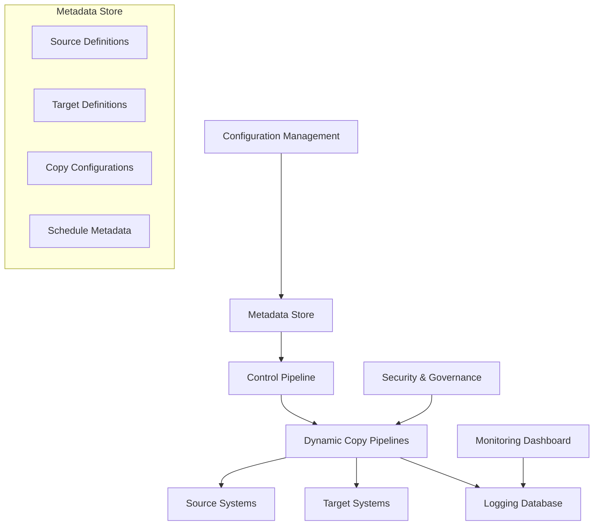

# Azure Metadata-Driven Large-Scale Data Copy Pipelines - Comprehensive Guide

## Table of Contents
1. [Overview](#overview)
2. [Metadata Framework Architecture](#metadata-framework-architecture)
3. [Copy Data Tool Fundamentals](#copy-data-tool-fundamentals)
4. [Metadata-Driven Design Patterns](#metadata-driven-design-patterns)
5. [Large-Scale Pipeline Implementation](#large-scale-pipeline-implementation)
6. [Monitoring and Logging](#monitoring-and-logging)
7. [Error Handling and Recovery](#error-handling-and-recovery)
8. [Performance Optimization](#performance-optimization)
9. [Security and Governance](#security-and-governance)
10. [Real-World Examples](#real-world-examples)
11. [Best Practices](#best-practices)
12. [Troubleshooting](#troubleshooting)

---

## Overview

Metadata-driven data copy pipelines represent a scalable, maintainable approach to building enterprise-level data integration solutions in Azure Data Factory. This methodology separates pipeline logic from configuration data, enabling dynamic pipeline behavior based on metadata stored in databases or configuration files.

### Key Benefits of Metadata-Driven Approach

| Benefit | Description | Business Impact |
|---------|-------------|-----------------|
| **Scalability** | Add new data sources without pipeline changes | Faster time-to-market for new integrations |
| **Maintainability** | Centralized configuration management | Reduced operational overhead |
| **Flexibility** | Dynamic pipeline behavior based on metadata | Adaptable to changing business requirements |
| **Consistency** | Standardized data movement patterns | Improved data quality and reliability |
| **Monitoring** | Centralized logging and monitoring | Better operational visibility |

### Architecture Components



---

## Metadata Framework Architecture

### Core Metadata Schema Design

```sql
-- Create metadata database schema for large-scale copy operations
CREATE DATABASE MetadataDrivenCopy;
GO

USE MetadataDrivenCopy;
GO

-- Source System Definitions
CREATE TABLE SourceSystems (
    SourceSystemId INT IDENTITY(1,1) PRIMARY KEY,
    SourceSystemName NVARCHAR(100) NOT NULL UNIQUE,
    SourceType NVARCHAR(50) NOT NULL, -- SqlServer, Oracle, MySQL, PostgreSQL, etc.
    ConnectionString NVARCHAR(500),
    KeyVaultSecretName NVARCHAR(100),
    IsActive BIT DEFAULT 1,
    CreatedDate DATETIME2 DEFAULT GETDATE(),
    ModifiedDate DATETIME2 DEFAULT GETDATE(),
    CreatedBy NVARCHAR(100),
    ModifiedBy NVARCHAR(100)
);

-- Target System Definitions
CREATE TABLE TargetSystems (
    TargetSystemId INT IDENTITY(1,1) PRIMARY KEY,
    TargetSystemName NVARCHAR(100) NOT NULL UNIQUE,
    TargetType NVARCHAR(50) NOT NULL, -- AzureSqlDatabase, DataLake, Synapse, etc.
    ConnectionString NVARCHAR(500),
    KeyVaultSecretName NVARCHAR(100),
    StorageAccountName NVARCHAR(100),
    ContainerName NVARCHAR(100),
    IsActive BIT DEFAULT 1,
    CreatedDate DATETIME2 DEFAULT GETDATE(),
    ModifiedDate DATETIME2 DEFAULT GETDATE(),
    CreatedBy NVARCHAR(100),
    ModifiedBy NVARCHAR(100)
);

-- Copy Configuration Master
CREATE TABLE CopyConfigurations (
    ConfigurationId INT IDENTITY(1,1) PRIMARY KEY,
    ConfigurationName NVARCHAR(200) NOT NULL,
    SourceSystemId INT NOT NULL,
    TargetSystemId INT NOT NULL,
    SourceObjectName NVARCHAR(200) NOT NULL,
    TargetObjectName NVARCHAR(200) NOT NULL,
    CopyType NVARCHAR(50) NOT NULL, -- Full, Incremental, Delta
    IncrementalColumn NVARCHAR(100),
    LastWatermarkValue NVARCHAR(100),
    BatchSize INT DEFAULT 10000,
    ParallelCopies INT DEFAULT 4,
    DataIntegrationUnits INT DEFAULT 4,
    EnableStaging BIT DEFAULT 0,
    StagingLinkedService NVARCHAR(100),
    StagingPath NVARCHAR(200),
    PreCopyScript NVARCHAR(MAX),
    PostCopyScript NVARCHAR(MAX),
    Priority INT DEFAULT 5,
    IsActive BIT DEFAULT 1,
    CreatedDate DATETIME2 DEFAULT GETDATE(),
    ModifiedDate DATETIME2 DEFAULT GETDATE(),
    CreatedBy NVARCHAR(100),
    ModifiedBy NVARCHAR(100),
    
    FOREIGN KEY (SourceSystemId) REFERENCES SourceSystems(SourceSystemId),
    FOREIGN KEY (TargetSystemId) REFERENCES TargetSystems(TargetSystemId)
);

-- Column Mapping Configuration
CREATE TABLE ColumnMappings (
    MappingId INT IDENTITY(1,1) PRIMARY KEY,
    ConfigurationId INT NOT NULL,
    SourceColumnName NVARCHAR(100) NOT NULL,
    TargetColumnName NVARCHAR(100) NOT NULL,
    DataType NVARCHAR(50),
    MaxLength INT,
    IsNullable BIT DEFAULT 1,
    DefaultValue NVARCHAR(100),
    TransformationRule NVARCHAR(500),
    IsActive BIT DEFAULT 1,
    
    FOREIGN KEY (ConfigurationId) REFERENCES CopyConfigurations(ConfigurationId)
);

-- Schedule Configuration
CREATE TABLE ScheduleConfigurations (
    ScheduleId INT IDENTITY(1,1) PRIMARY KEY,
    ConfigurationId INT NOT NULL,
    ScheduleType NVARCHAR(50) NOT NULL, -- Daily, Weekly, Monthly, Hourly, OnDemand
    ScheduleExpression NVARCHAR(100), -- Cron expression or frequency
    StartDate DATE,
    EndDate DATE,
    TimeZone NVARCHAR(50) DEFAULT 'UTC',
    IsActive BIT DEFAULT 1,
    CreatedDate DATETIME2 DEFAULT GETDATE(),
    
    FOREIGN KEY (ConfigurationId) REFERENCES CopyConfigurations(ConfigurationId)
);

-- Execution History
CREATE TABLE CopyExecutionHistory (
    ExecutionId BIGINT IDENTITY(1,1) PRIMARY KEY,
    ConfigurationId INT NOT NULL,
    PipelineRunId NVARCHAR(100),
    ActivityRunId NVARCHAR(100),
    ExecutionStartTime DATETIME2,
    ExecutionEndTime DATETIME2,
    Status NVARCHAR(50), -- Running, Succeeded, Failed, Cancelled
    RowsCopied BIGINT,
    DataRead BIGINT,
    DataWritten BIGINT,
    CopyDuration INT, -- in seconds
    ErrorMessage NVARCHAR(MAX),
    WatermarkValue NVARCHAR(100),
    CreatedDate DATETIME2 DEFAULT GETDATE(),
    
    FOREIGN KEY (ConfigurationId) REFERENCES CopyConfigurations(ConfigurationId)
);

-- Data Quality Rules
CREATE TABLE DataQualityRules (
    RuleId INT IDENTITY(1,1) PRIMARY KEY,
    ConfigurationId INT NOT NULL,
    RuleName NVARCHAR(100) NOT NULL,
    RuleType NVARCHAR(50) NOT NULL, -- RowCount, ColumnCheck, DataType, Range, etc.
    RuleExpression NVARCHAR(500),
    Threshold DECIMAL(10,2),
    Severity NVARCHAR(20) DEFAULT 'Warning', -- Info, Warning, Error, Critical
    IsActive BIT DEFAULT 1,
    CreatedDate DATETIME2 DEFAULT GETDATE(),
    
    FOREIGN KEY (ConfigurationId) REFERENCES CopyConfigurations(ConfigurationId)
);

-- Dependency Management
CREATE TABLE CopyDependencies (
    DependencyId INT IDENTITY(1,1) PRIMARY KEY,
    ConfigurationId INT NOT NULL,
    DependsOnConfigurationId INT NOT NULL,
    DependencyType NVARCHAR(50) DEFAULT 'Sequential', -- Sequential, Conditional
    IsActive BIT DEFAULT 1,
    
    FOREIGN KEY (ConfigurationId) REFERENCES CopyConfigurations(ConfigurationId),
    FOREIGN KEY (DependsOnConfigurationId) REFERENCES CopyConfigurations(ConfigurationId)
);
```

### Metadata Management Stored Procedures

```sql
-- Stored procedure to get active copy configurations
CREATE PROCEDURE GetActiveCopyConfigurations
    @SourceSystemName NVARCHAR(100) = NULL,
    @TargetSystemName NVARCHAR(100) = NULL,
    @Priority INT = NULL
AS
BEGIN
    SET NOCOUNT ON;
    
    SELECT 
        cc.ConfigurationId,
        cc.ConfigurationName,
        ss.SourceSystemName,
        ss.SourceType,
        ss.ConnectionString AS SourceConnectionString,
        ss.KeyVaultSecretName AS SourceKeyVaultSecret,
        ts.TargetSystemName,
        ts.TargetType,
        ts.ConnectionString AS TargetConnectionString,
        ts.KeyVaultSecretName AS TargetKeyVaultSecret,
        ts.StorageAccountName,
        ts.ContainerName,
        cc.SourceObjectName,
        cc.TargetObjectName,
        cc.CopyType,
        cc.IncrementalColumn,
        cc.LastWatermarkValue,
        cc.BatchSize,
        cc.ParallelCopies,
        cc.DataIntegrationUnits,
        cc.EnableStaging,
        cc.StagingLinkedService,
        cc.StagingPath,
        cc.PreCopyScript,
        cc.PostCopyScript,
        cc.Priority
    FROM CopyConfigurations cc
    INNER JOIN SourceSystems ss ON cc.SourceSystemId = ss.SourceSystemId
    INNER JOIN TargetSystems ts ON cc.TargetSystemId = ts.TargetSystemId
    WHERE cc.IsActive = 1
        AND ss.IsActive = 1
        AND ts.IsActive = 1
        AND (@SourceSystemName IS NULL OR ss.SourceSystemName = @SourceSystemName)
        AND (@TargetSystemName IS NULL OR ts.TargetSystemName = @TargetSystemName)
        AND (@Priority IS NULL OR cc.Priority = @Priority)
    ORDER BY cc.Priority, cc.ConfigurationName;
END;
GO

-- Stored procedure to update watermark value
CREATE PROCEDURE UpdateWatermarkValue
    @ConfigurationId INT,
    @NewWatermarkValue NVARCHAR(100),
    @PipelineRunId NVARCHAR(100) = NULL
AS
BEGIN
    SET NOCOUNT ON;
    
    BEGIN TRANSACTION;
    
    BEGIN TRY
        -- Update the watermark value
        UPDATE CopyConfigurations 
        SET LastWatermarkValue = @NewWatermarkValue,
            ModifiedDate = GETDATE()
        WHERE ConfigurationId = @ConfigurationId;
        
        -- Log the watermark update
        INSERT INTO CopyExecutionHistory (
            ConfigurationId, 
            PipelineRunId, 
            Status, 
            WatermarkValue,
            ExecutionStartTime
        )
        VALUES (
            @ConfigurationId, 
            @PipelineRunId, 
            'WatermarkUpdated', 
            @NewWatermarkValue,
            GETDATE()
        );
        
        COMMIT TRANSACTION;
        
        SELECT 'Success' AS Result, 'Watermark updated successfully' AS Message;
        
    END TRY
    BEGIN CATCH
        ROLLBACK TRANSACTION;
        
        SELECT 'Error' AS Result, ERROR_MESSAGE() AS Message;
    END CATCH
END;
GO

-- Stored procedure to log copy execution
CREATE PROCEDURE LogCopyExecution
    @ConfigurationId INT,
    @PipelineRunId NVARCHAR(100),
    @ActivityRunId NVARCHAR(100),
    @Status NVARCHAR(50),
    @RowsCopied BIGINT = NULL,
    @DataRead BIGINT = NULL,
    @DataWritten BIGINT = NULL,
    @CopyDuration INT = NULL,
    @ErrorMessage NVARCHAR(MAX) = NULL,
    @WatermarkValue NVARCHAR(100) = NULL
AS
BEGIN
    SET NOCOUNT ON;
    
    INSERT INTO CopyExecutionHistory (
        ConfigurationId,
        PipelineRunId,
        ActivityRunId,
        ExecutionStartTime,
        ExecutionEndTime,
        Status,
        RowsCopied,
        DataRead,
        DataWritten,
        CopyDuration,
        ErrorMessage,
        WatermarkValue
    )
    VALUES (
        @ConfigurationId,
        @PipelineRunId,
        @ActivityRunId,
        CASE WHEN @Status = 'Running' THEN GETDATE() ELSE NULL END,
        CASE WHEN @Status IN ('Succeeded', 'Failed', 'Cancelled') THEN GETDATE() ELSE NULL END,
        @Status,
        @RowsCopied,
        @DataRead,
        @DataWritten,
        @CopyDuration,
        @ErrorMessage,
        @WatermarkValue
    );
END;
GO
```

---

## Copy Data Tool Fundamentals

### Understanding Azure Data Factory Copy Data Tool

The Copy Data Tool in Azure Data Factory provides a guided experience for creating data copy pipelines. When combined with metadata-driven approaches, it becomes a powerful foundation for large-scale data integration.

#### Copy Data Tool Capabilities

```json
{
    "copyDataToolCapabilities": {
        "sourceConnectors": [
            "Azure SQL Database",
            "SQL Server",
            "Oracle",
            "MySQL",
            "PostgreSQL",
            "Azure Blob Storage",
            "Azure Data Lake Storage",
            "Amazon S3",
            "Salesforce",
            "SAP HANA",
            "REST API",
            "File System"
        ],
        "targetConnectors": [
            "Azure SQL Database",
            "Azure Synapse Analytics",
            "Azure Data Lake Storage",
            "Azure Blob Storage",
            "Azure Cosmos DB",
            "Power BI",
            "Azure Search"
        ],
        "transformationCapabilities": [
            "Column mapping",
            "Data type conversion",
            "Filter conditions",
            "Aggregations",
            "Derived columns"
        ],
        "performanceFeatures": [
            "Parallel copying",
            "Data Integration Units scaling",
            "Staged copying",
            "Incremental loading"
        ]
    }
}
```

### Enhanced Copy Data Tool Configuration

```python
# Python class for generating Copy Data Tool configurations
import json
from typing import Dict, List, Any, Optional
from dataclasses import dataclass
from datetime import datetime

@dataclass
class SourceConfiguration:
    name: str
    connection_type: str
    connection_string: str
    object_name: str
    incremental_column: Optional[str] = None
    watermark_value: Optional[str] = None
    query: Optional[str] = None

@dataclass
class TargetConfiguration:
    name: str
    connection_type: str
    connection_string: str
    object_name: str
    write_behavior: str = "insert"
    pre_copy_script: Optional[str] = None
    post_copy_script: Optional[str] = None

@dataclass
class CopySettings:
    parallel_copies: int = 4
    data_integration_units: int = 4
    enable_staging: bool = False
    staging_settings: Optional[Dict[str, Any]] = None
    fault_tolerance_settings: Optional[Dict[str, Any]] = None

class CopyDataToolConfigGenerator:
    """
    Generate Copy Data Tool configurations for metadata-driven pipelines
    """
    
    def __init__(self):
        self.configurations = []
        self.templates = {
            "sql_to_adls": self._get_sql_to_adls_template(),
            "adls_to_sql": self._get_adls_to_sql_template(),
            "sql_to_synapse": self._get_sql_to_synapse_template(),
            "incremental_copy": self._get_incremental_copy_template()
        }
    
    def generate_copy_configuration(self, 
                                   source: SourceConfiguration,
                                   target: TargetConfiguration,
                                   copy_settings: CopySettings,
                                   template_type: str = "sql_to_adls") -> Dict[str, Any]:
        """
        Generate comprehensive copy configuration
        """
        base_template = self.templates.get(template_type, self.templates["sql_to_adls"])
        
        configuration = {
            "name": f"Copy_{source.name}_to_{target.name}",
            "properties": {
                "activities": [
                    {
                        "name": f"Copy_{source.name}_to_{target.name}",
                        "type": "Copy",
                        "dependsOn": [],
                        "policy": {
                            "timeout": "0.12:00:00",
                            "retry": 3,
                            "retryIntervalInSeconds": 30,
                            "secureOutput": False,
                            "secureInput": False
                        },
                        "userProperties": [
                            {
                                "name": "Source",
                                "value": source.object_name
                            },
                            {
                                "name": "Destination", 
                                "value": target.object_name
                            }
                        ],
                        "typeProperties": {
                            "source": self._build_source_config(source, template_type),
                            "sink": self._build_sink_config(target, template_type),
                            "enableStaging": copy_settings.enable_staging,
                            "parallelCopies": copy_settings.parallel_copies,
                            "dataIntegrationUnits": copy_settings.data_integration_units,
                            "translator": {
                                "type": "TabularTranslator",
                                "typeConversion": True,
                                "typeConversionSettings": {
                                    "allowDataTruncation": True,
                                    "treatBooleanAsNumber": False
                                }
                            }
                        },
                        "inputs": [
                            {
                                "referenceName": f"{source.name}_Dataset",
                                "type": "DatasetReference"
                            }
                        ],
                        "outputs": [
                            {
                                "referenceName": f"{target.name}_Dataset", 
                                "type": "DatasetReference"
                            }
                        ]
                    }
                ]
            }
        }
        
        # Add staging configuration if enabled
        if copy_settings.enable_staging and copy_settings.staging_settings:
            configuration["properties"]["activities"][0]["typeProperties"]["stagingSettings"] = copy_settings.staging_settings
        
        # Add fault tolerance settings
        if copy_settings.fault_tolerance_settings:
            configuration["properties"]["activities"][0]["typeProperties"].update(copy_settings.fault_tolerance_settings)
        
        return configuration
    
    def _build_source_config(self, source: SourceConfiguration, template_type: str) -> Dict[str, Any]:
        """
        Build source configuration based on connection type
        """
        base_config = {
            "type": self._get_source_type(source.connection_type),
            "storeSettings": {
                "type": self._get_store_settings_type(source.connection_type)
            }
        }
        
        if source.connection_type in ["SqlServer", "AzureSqlDatabase"]:
            if source.query:
                base_config["sqlReaderQuery"] = source.query
            else:
                base_config["tableName"] = source.object_name
            
            # Add incremental loading for SQL sources
            if source.incremental_column and source.watermark_value:
                base_config["sqlReaderQuery"] = f"""
                    SELECT * FROM {source.object_name} 
                    WHERE {source.incremental_column} > '{source.watermark_value}'
                """
        
        elif source.connection_type in ["AzureBlobStorage", "AzureDataLakeStorage"]:
            base_config["storeSettings"].update({
                "recursive": True,
                "wildcardFileName": "*.csv",
                "enablePartitionDiscovery": False
            })
            
            base_config["formatSettings"] = {
                "type": "DelimitedTextReadSettings",
                "skipLineCount": 0
            }
        
        return base_config
    
    def _build_sink_config(self, target: TargetConfiguration, template_type: str) -> Dict[str, Any]:
        """
        Build sink configuration based on connection type
        """
        base_config = {
            "type": self._get_sink_type(target.connection_type),
            "storeSettings": {
                "type": self._get_store_settings_type(target.connection_type)
            }
        }
        
        if target.connection_type in ["SqlServer", "AzureSqlDatabase"]:
            base_config.update({
                "writeBehavior": target.write_behavior,
                "sqlWriterUseTableLock": False,
                "tableOption": "autoCreate"
            })
            
            if target.pre_copy_script:
                base_config["preCopyScript"] = target.pre_copy_script
        
        elif target.connection_type in ["AzureBlobStorage", "AzureDataLakeStorage"]:
            base_config["storeSettings"].update({
                "copyBehavior": "PreserveHierarchy"
            })
            
            base_config["formatSettings"] = {
                "type": "DelimitedTextWriteSettings",
                "quoteAllText": True,
                "fileExtension": ".csv"
            }
        
        return base_config
    
    def _get_source_type(self, connection_type: str) -> str:
        """Get source type based on connection type"""
        type_mapping = {
            "SqlServer": "SqlServerSource",
            "AzureSqlDatabase": "AzureSqlSource",
            "Oracle": "OracleSource",
            "MySQL": "MySqlSource",
            "PostgreSQL": "PostgreSqlSource",
            "AzureBlobStorage": "DelimitedTextSource",
            "AzureDataLakeStorage": "DelimitedTextSource"
        }
        return type_mapping.get(connection_type, "DelimitedTextSource")
    
    def _get_sink_type(self, connection_type: str) -> str:
        """Get sink type based on connection type"""
        type_mapping = {
            "SqlServer": "SqlServerSink",
            "AzureSqlDatabase": "AzureSqlSink",
            "AzureSynapseAnalytics": "SqlDWSink",
            "AzureBlobStorage": "DelimitedTextSink",
            "AzureDataLakeStorage": "DelimitedTextSink"
        }
        return type_mapping.get(connection_type, "DelimitedTextSink")
    
    def _get_store_settings_type(self, connection_type: str) -> str:
        """Get store settings type"""
        type_mapping = {
            "AzureBlobStorage": "AzureBlobStorageReadSettings",
            "AzureDataLakeStorage": "AzureBlobFSReadSettings"
        }
        return type_mapping.get(connection_type, "")
    
    def _get_sql_to_adls_template(self) -> Dict[str, Any]:
        """Template for SQL to ADLS copy"""
        return {
            "source_type": "sql",
            "target_type": "adls",
            "supports_incremental": True,
            "supports_staging": True
        }
    
    def _get_adls_to_sql_template(self) -> Dict[str, Any]:
        """Template for ADLS to SQL copy"""
        return {
            "source_type": "adls",
            "target_type": "sql",
            "supports_incremental": False,
            "supports_staging": True
        }
    
    def _get_sql_to_synapse_template(self) -> Dict[str, Any]:
        """Template for SQL to Synapse copy"""
        return {
            "source_type": "sql",
            "target_type": "synapse",
            "supports_incremental": True,
            "supports_staging": True,
            "recommended_staging": True
        }
    
    def _get_incremental_copy_template(self) -> Dict[str, Any]:
        """Template for incremental copy operations"""
        return {
            "supports_watermark": True,
            "supports_change_tracking": True,
            "supports_delta_copy": True
        }
    
    def generate_dataset_configuration(self, 
                                     connection_config: Dict[str, Any],
                                     object_name: str,
                                     connection_type: str) -> Dict[str, Any]:
        """
        Generate dataset configuration for copy operations
        """
        dataset_config = {
            "name": f"{connection_config['name']}_Dataset",
            "properties": {
                "linkedServiceName": {
                    "referenceName": connection_config['name'],
                    "type": "LinkedServiceReference"
                },
                "annotations": [],
                "type": self._get_dataset_type(connection_type),
                "typeProperties": self._get_dataset_type_properties(connection_type, object_name)
            }
        }
        
        return dataset_config
    
    def _get_dataset_type(self, connection_type: str) -> str:
        """Get dataset type based on connection type"""
        type_mapping = {
            "SqlServer": "SqlServerTable",
            "AzureSqlDatabase": "AzureSqlTable",
            "Oracle": "OracleTable",
            "MySQL": "MySqlTable",
            "PostgreSQL": "PostgreSqlTable",
            "AzureBlobStorage": "DelimitedText",
            "AzureDataLakeStorage": "DelimitedText"
        }
        return type_mapping.get(connection_type, "DelimitedText")
    
    def _get_dataset_type_properties(self, connection_type: str, object_name: str) -> Dict[str, Any]:
        """Get dataset type properties"""
        if connection_type in ["SqlServer", "AzureSqlDatabase", "Oracle", "MySQL", "PostgreSQL"]:
            return {
                "tableName": object_name
            }
        elif connection_type in ["AzureBlobStorage", "AzureDataLakeStorage"]:
            return {
                "location": {
                    "type": "AzureBlobFSLocation" if connection_type == "AzureDataLakeStorage" else "AzureBlobStorageLocation",
                    "fileName": object_name,
                    "container": "data"
                },
                "columnDelimiter": ",",
                "escapeChar": "\\",
                "firstRowAsHeader": True,
                "quoteChar": "\""
            }
        else:
            return {}

# Example usage
config_generator = CopyDataToolConfigGenerator()

# Define source and target configurations
source_config = SourceConfiguration(
    name="SourceSQLServer",
    connection_type="SqlServer",
    connection_string="Server=source-server;Database=SourceDB;",
    object_name="dbo.Customers",
    incremental_column="ModifiedDate",
    watermark_value="2024-01-01"
)

target_config = TargetConfiguration(
    name="TargetADLS",
    connection_type="AzureDataLakeStorage",
    connection_string="https://yourstorageaccount.dfs.core.windows.net",
    object_name="customers.csv",
    write_behavior="insert"
)

copy_settings = CopySettings(
    parallel_copies=8,
    data_integration_units=8,
    enable_staging=True,
    staging_settings={
        "linkedServiceName": {
            "referenceName": "StagingBlobStorage",
            "type": "LinkedServiceReference"
        },
        "path": "staging/copy-operations"
    }
)

# Generate copy configuration
copy_config = config_generator.generate_copy_configuration(
    source=source_config,
    target=target_config,
    copy_settings=copy_settings,
    template_type="sql_to_adls"
)

print("📋 Generated Copy Configuration:")
print(json.dumps(copy_config, indent=2))
```

---

## Metadata-Driven Design Patterns

### Master Control Pipeline Pattern

```json
{
    "name": "MetadataDrivenMasterPipeline",
    "properties": {
        "parameters": {
            "SourceSystemFilter": {
                "type": "string",
                "defaultValue": ""
            },
            "TargetSystemFilter": {
                "type": "string", 
                "defaultValue": ""
            },
            "PriorityFilter": {
                "type": "int",
                "defaultValue": -1
            },
            "ExecutionMode": {
                "type": "string",
                "defaultValue": "Full"
            }
        },
        "variables": {
            "CopyConfigurations": {
                "type": "Array"
            },
            "CurrentBatch": {
                "type": "Array"
            },
            "ExecutionSummary": {
                "type": "Object"
            }
        },
        "activities": [
            {
                "name": "GetCopyConfigurations",
                "type": "Lookup",
                "typeProperties": {
                    "source": {
                        "type": "AzureSqlSource",
                        "sqlReaderStoredProcedureName": "GetActiveCopyConfigurations",
                        "storedProcedureParameters": {
                            "SourceSystemName": {
                                "type": "String",
                                "value": {
                                    "value": "@pipeline().parameters.SourceSystemFilter",
                                    "type": "Expression"
                                }
                            },
                            "TargetSystemName": {
                                "type": "String",
                                "value": {
                                    "value": "@pipeline().parameters.TargetSystemFilter",
                                    "type": "Expression"
                                }
                            },
                            "Priority": {
                                "type": "Int32",
                                "value": {
                                    "value": "@if(equals(pipeline().parameters.PriorityFilter, -1), null, pipeline().parameters.PriorityFilter)",
                                    "type": "Expression"
                                }
                            }
                        }
                    },
                    "dataset": {
                        "referenceName": "MetadataDatabase",
                        "type": "DatasetReference"
                    },
                    "firstRowOnly": false
                }
            },
            {
                "name": "SetCopyConfigurations",
                "type": "SetVariable",
                "dependsOn": [
                    {
                        "activity": "GetCopyConfigurations",
                        "dependencyConditions": ["Succeeded"]
                    }
                ],
                "typeProperties": {
                    "variableName": "CopyConfigurations",
                    "value": {
                        "value": "@activity('GetCopyConfigurations').output.value",
                        "type": "Expression"
                    }
                }
            },
            {
                "name": "ProcessCopyConfigurations",
                "type": "ForEach",
                "dependsOn": [
                    {
                        "activity": "SetCopyConfigurations",
                        "dependencyConditions": ["Succeeded"]
                    }
                ],
                "typeProperties": {
                    "items": {
                        "value": "@variables('CopyConfigurations')",
                        "type": "Expression"
                    },
                    "isSequential": false,
                    "batchCount": 10,
                    "activities": [
                        {
                            "name": "ExecuteDynamicCopyPipeline",
                            "type": "ExecutePipeline",
                            "typeProperties": {
                                "pipeline": {
                                    "referenceName": "DynamicCopyPipeline",
                                    "type": "PipelineReference"
                                },
                                "parameters": {
                                    "ConfigurationId": {
                                        "value": "@item().ConfigurationId",
                                        "type": "Expression"
                                    },
                                    "ConfigurationName": {
                                        "value": "@item().ConfigurationName",
                                        "type": "Expression"
                                    },
                                    "SourceSystemName": {
                                        "value": "@item().SourceSystemName",
                                        "type": "Expression"
                                    },
                                    "SourceType": {
                                        "value": "@item().SourceType",
                                        "type": "Expression"
                                    },
                                    "SourceConnectionString": {
                                        "value": "@item().SourceConnectionString",
                                        "type": "Expression"
                                    },
                                    "SourceObjectName": {
                                        "value": "@item().SourceObjectName",
                                        "type": "Expression"
                                    },
                                    "TargetSystemName": {
                                        "value": "@item().TargetSystemName",
                                        "type": "Expression"
                                    },
                                    "TargetType": {
                                        "value": "@item().TargetType",
                                        "type": "Expression"
                                    },
                                    "TargetConnectionString": {
                                        "value": "@item().TargetConnectionString",
                                        "type": "Expression"
                                    },
                                    "TargetObjectName": {
                                        "value": "@item().TargetObjectName",
                                        "type": "Expression"
                                    },
                                    "CopyType": {
                                        "value": "@item().CopyType",
                                        "type": "Expression"
                                    },
                                    "IncrementalColumn": {
                                        "value": "@item().IncrementalColumn",
                                        "type": "Expression"
                                    },
                                    "LastWatermarkValue": {
                                        "value": "@item().LastWatermarkValue",
                                        "type": "Expression"
                                    },
                                    "BatchSize": {
                                        "value": "@item().BatchSize",
                                        "type": "Expression"
                                    },
                                    "ParallelCopies": {
                                        "value": "@item().ParallelCopies",
                                        "type": "Expression"
                                    },
                                    "DataIntegrationUnits": {
                                        "value": "@item().DataIntegrationUnits",
                                        "type": "Expression"
                                    },
                                    "ExecutionMode": {
                                        "value": "@pipeline().parameters.ExecutionMode",
                                        "type": "Expression"
                                    }
                                },
                                "waitOnCompletion": true
                            }
                        }
                    ]
                }
            },
            {
                "name": "LogPipelineExecution",
                "type": "SqlServerStoredProcedure",
                "dependsOn": [
                    {
                        "activity": "ProcessCopyConfigurations",
                        "dependencyConditions": ["Completed"]
                    }
                ],
                "typeProperties": {
                    "storedProcedureName": "LogPipelineExecution",
                    "storedProcedureParameters": {
                        "PipelineRunId": {
                            "value": {
                                "value": "@pipeline().RunId",
                                "type": "Expression"
                            },
                            "type": "String"
                        },
                        "PipelineName": {
                            "value": {
                                "value": "@pipeline().Pipeline",
                                "type": "Expression"
                            },
                            "type": "String"
                        },
                        "ExecutionStatus": {
                            "value": {
                                "value": "@if(equals(activity('ProcessCopyConfigurations').output.pipelineReturnValue.status, 'Succeeded'), 'Success', 'Failed')",
                                "type": "Expression"
                            },
                            "type": "String"
                        },
                        "ConfigurationsProcessed": {
                            "value": {
                                "value": "@length(variables('CopyConfigurations'))",
                                "type": "Expression"
                            },
                            "type": "Int32"
                        }
                    }
                },
                "linkedServiceName": {
                    "referenceName": "MetadataDatabase",
                    "type": "LinkedServiceReference"
                }
            }
        ]
    }
}
```

### Dynamic Copy Pipeline Implementation

```json
{
    "name": "DynamicCopyPipeline",
    "properties": {
        "parameters": {
            "ConfigurationId": {"type": "int"},
            "ConfigurationName": {"type": "string"},
            "SourceSystemName": {"type": "string"},
            "SourceType": {"type": "string"},
            "SourceConnectionString": {"type": "string"},
            "SourceObjectName": {"type": "string"},
            "TargetSystemName": {"type": "string"},
            "TargetType": {"type": "string"},
            "TargetConnectionString": {"type": "string"},
            "TargetObjectName": {"type": "string"},
            "CopyType": {"type": "string"},
            "IncrementalColumn": {"type": "string"},
            "LastWatermarkValue": {"type": "string"},
            "BatchSize": {"type": "int"},
            "ParallelCopies": {"type": "int"},
            "DataIntegrationUnits": {"type": "int"},
            "ExecutionMode": {"type": "string"}
        },
        "variables": {
            "SourceQuery": {"type": "String"},
            "NewWatermarkValue": {"type": "String"},
            "CopyActivityOutput": {"type": "Object"}
        },
        "activities": [
            {
                "name": "LogCopyStart",
                "type": "SqlServerStoredProcedure",
                "typeProperties": {
                    "storedProcedureName": "LogCopyExecution",
                    "storedProcedureParameters": {
                        "ConfigurationId": {
                            "value": {"value": "@pipeline().parameters.ConfigurationId", "type": "Expression"},
                            "type": "Int32"
                        },
                        "PipelineRunId": {
                            "value": {"value": "@pipeline().RunId", "type": "Expression"},
                            "type": "String"
                        },
                        "ActivityRunId": {
                            "value": {"value": "@pipeline().RunId", "type": "Expression"},
                            "type": "String"
                        },
                        "Status": {
                            "value": "Running",
                            "type": "String"
                        }
                    }
                },
                "linkedServiceName": {
                    "referenceName": "MetadataDatabase",
                    "type": "LinkedServiceReference"
                }
            },
            {
                "name": "DetermineSourceQuery",
                "type": "IfCondition",
                "dependsOn": [
                    {
                        "activity": "LogCopyStart",
                        "dependencyConditions": ["Succeeded"]
                    }
                ],
                "typeProperties": {
                    "expression": {
                        "value": "@equals(pipeline().parameters.CopyType, 'Incremental')",
                        "type": "Expression"
                    },
                    "ifTrueActivities": [
                        {
                            "name": "SetIncrementalQuery",
                            "type": "SetVariable",
                            "typeProperties": {
                                "variableName": "SourceQuery",
                                "value": {
                                    "value": "@concat('SELECT * FROM ', pipeline().parameters.SourceObjectName, ' WHERE ', pipeline().parameters.IncrementalColumn, ' > ''', pipeline().parameters.LastWatermarkValue, '''')",
                                    "type": "Expression"
                                }
                            }
                        }
                    ],
                    "ifFalseActivities": [
                        {
                            "name": "SetFullQuery",
                            "type": "SetVariable",
                            "typeProperties": {
                                "variableName": "SourceQuery",
                                "value": {
                                    "value": "@concat('SELECT * FROM ', pipeline().parameters.SourceObjectName)",
                                    "type": "Expression"
                                }
                            }
                        }
                    ]
                }
            },
            {
                "name": "GetMaxWatermarkValue",
                "type": "IfCondition",
                "dependsOn": [
                    {
                        "activity": "DetermineSourceQuery",
                        "dependencyConditions": ["Succeeded"]
                    }
                ],
                "typeProperties": {
                    "expression": {
                        "value": "@equals(pipeline().parameters.CopyType, 'Incremental')",
                        "type": "Expression"
                    },
                    "ifTrueActivities": [
                        {
                            "name": "LookupMaxWatermark",
                            "type": "Lookup",
                            "typeProperties": {
                                "source": {
                                    "type": "SqlServerSource",
                                    "sqlReaderQuery": {
                                        "value": "@concat('SELECT MAX(', pipeline().parameters.IncrementalColumn, ') AS MaxWatermarkValue FROM ', pipeline().parameters.SourceObjectName)",
                                        "type": "Expression"
                                    }
                                },
                                "dataset": {
                                    "referenceName": "GenericSqlServerDataset",
                                    "type": "DatasetReference",
                                    "parameters": {
                                        "ConnectionString": {
                                            "value": "@pipeline().parameters.SourceConnectionString",
                                            "type": "Expression"
                                        },
                                        "TableName": {
                                            "value": "@pipeline().parameters.SourceObjectName",
                                            "type": "Expression"
                                        }
                                    }
                                }
                            }
                        },
                        {
                            "name": "SetNewWatermarkValue",
                            "type": "SetVariable",
                            "dependsOn": [
                                {
                                    "activity": "LookupMaxWatermark",
                                    "dependencyConditions": ["Succeeded"]
                                }
                            ],
                            "typeProperties": {
                                "variableName": "NewWatermarkValue",
                                "value": {
                                    "value": "@string(activity('LookupMaxWatermark').output.firstRow.MaxWatermarkValue)",
                                    "type": "Expression"
                                }
                            }
                        }
                    ]
                }
            },
            {
                "name": "DynamicCopyActivity",
                "type": "Copy",
                "dependsOn": [
                    {
                        "activity": "GetMaxWatermarkValue",
                        "dependencyConditions": ["Succeeded"]
                    }
                ],
                "policy": {
                    "timeout": "0.12:00:00",
                    "retry": 3,
                    "retryIntervalInSeconds": 30,
                    "secureOutput": false,
                    "secureInput": false
                },
                "userProperties": [
                    {
                        "name": "Source",
                        "value": "@pipeline().parameters.SourceObjectName"
                    },
                    {
                        "name": "Destination",
                        "value": "@pipeline().parameters.TargetObjectName"
                    }
                ],
                "typeProperties": {
                    "source": {
                        "type": "SqlServerSource",
                        "sqlReaderQuery": {
                            "value": "@variables('SourceQuery')",
                            "type": "Expression"
                        },
                        "queryTimeout": "02:00:00",
                        "partitionOption": "None"
                    },
                    "sink": {
                        "type": "DelimitedTextSink",
                        "storeSettings": {
                            "type": "AzureBlobFSWriteSettings"
                        },
                        "formatSettings": {
                            "type": "DelimitedTextWriteSettings",
                            "quoteAllText": true,
                            "fileExtension": ".csv"
                        }
                    },
                    "enableStaging": false,
                    "parallelCopies": {
                        "value": "@pipeline().parameters.ParallelCopies",
                        "type": "Expression"
                    },
                    "dataIntegrationUnits": {
                        "value": "@pipeline().parameters.DataIntegrationUnits",
                        "type": "Expression"
                    },
                    "translator": {
                        "type": "TabularTranslator",
                        "typeConversion": true,
                        "typeConversionSettings": {
                            "allowDataTruncation": true,
                            "treatBooleanAsNumber": false
                        }
                    }
                },
                "inputs": [
                    {
                        "referenceName": "GenericSqlServerDataset",
                        "type": "DatasetReference",
                        "parameters": {
                            "ConnectionString": {
                                "value": "@pipeline().parameters.SourceConnectionString",
                                "type": "Expression"
                            },
                            "TableName": {
                                "value": "@pipeline().parameters.SourceObjectName",
                                "type": "Expression"
                            }
                        }
                    }
                ],
                "outputs": [
                    {
                        "referenceName": "GenericDataLakeDataset",
                        "type": "DatasetReference",
                        "parameters": {
                            "ConnectionString": {
                                "value": "@pipeline().parameters.TargetConnectionString",
                                "type": "Expression"
                            },
                            "FileName": {
                                "value": "@pipeline().parameters.TargetObjectName",
                                "type": "Expression"
                            }
                        }
                    }
                ]
            },
            {
                "name": "UpdateWatermarkValue",
                "type": "IfCondition",
                "dependsOn": [
                    {
                        "activity": "DynamicCopyActivity",
                        "dependencyConditions": ["Succeeded"]
                    }
                ],
                "typeProperties": {
                    "expression": {
                        "value": "@and(equals(pipeline().parameters.CopyType, 'Incremental'), not(empty(variables('NewWatermarkValue'))))",
                        "type": "Expression"
                    },
                    "ifTrueActivities": [
                        {
                            "name": "UpdateWatermark",
                            "type": "SqlServerStoredProcedure",
                            "typeProperties": {
                                "storedProcedureName": "UpdateWatermarkValue",
                                "storedProcedureParameters": {
                                    "ConfigurationId": {
                                        "value": {
                                            "value": "@pipeline().parameters.ConfigurationId",
                                            "type": "Expression"
                                        },
                                        "type": "Int32"
                                    },
                                    "NewWatermarkValue": {
                                        "value": {
                                            "value": "@variables('NewWatermarkValue')",
                                            "type": "Expression"
                                        },
                                        "type": "String"
                                    },
                                    "PipelineRunId": {
                                        "value": {
                                            "value": "@pipeline().RunId",
                                            "type": "Expression"
                                        },
                                        "type": "String"
                                    }
                                }
                            },
                            "linkedServiceName": {
                                "referenceName": "MetadataDatabase",
                                "type": "LinkedServiceReference"
                            }
                        }
                    ]
                }
            },
            {
                "name": "LogCopyCompletion",
                "type": "SqlServerStoredProcedure",
                "dependsOn": [
                    {
                        "activity": "UpdateWatermarkValue",
                        "dependencyConditions": ["Succeeded"]
                    }
                ],
                "typeProperties": {
                    "storedProcedureName": "LogCopyExecution",
                    "storedProcedureParameters": {
                        "ConfigurationId": {
                            "value": {"value": "@pipeline().parameters.ConfigurationId", "type": "Expression"},
                            "type": "Int32"
                        },
                        "PipelineRunId": {
                            "value": {"value": "@pipeline().RunId", "type": "Expression"},
                            "type": "String"
                        },
                        "ActivityRunId": {
                            "value": {"value": "@activity('DynamicCopyActivity').ActivityRunId", "type": "Expression"},
                            "type": "String"
                        },
                        "Status": {
                            "value": "Succeeded",
                            "type": "String"
                        },
                        "RowsCopied": {
                            "value": {"value": "@activity('DynamicCopyActivity').output.rowsCopied", "type": "Expression"},
                            "type": "Int64"
                        },
                        "DataRead": {
                            "value": {"value": "@activity('DynamicCopyActivity').output.dataRead", "type": "Expression"},
                            "type": "Int64"
                        },
                        "DataWritten": {
                            "value": {"value": "@activity('DynamicCopyActivity').output.dataWritten", "type": "Expression"},
                            "type": "Int64"
                        },
                        "CopyDuration": {
                            "value": {"value": "@activity('DynamicCopyActivity').output.copyDuration", "type": "Expression"},
                            "type": "Int32"
                        },
                        "WatermarkValue": {
                            "value": {"value": "@variables('NewWatermarkValue')", "type": "Expression"},
                            "type": "String"
                        }
                    }
                },
                "linkedServiceName": {
                    "referenceName": "MetadataDatabase",
                    "type": "LinkedServiceReference"
                }
            }
        ]
    }
}
```

---

## Large-Scale Pipeline Implementation

### Enterprise-Scale Metadata Management

```python
# Python framework for managing large-scale metadata-driven pipelines
import json
import logging
from typing import Dict, List, Any, Optional
from dataclasses import dataclass, asdict
from datetime import datetime, timedelta
from azure.identity import DefaultAzureCredential
from azure.mgmt.datafactory import DataFactoryManagementClient
from azure.mgmt.datafactory.models import *
import pyodbc

@dataclass
class PipelineExecutionMetrics:
    configuration_id: int
    pipeline_run_id: str
    execution_start_time: datetime
    execution_end_time: Optional[datetime]
    status: str
    rows_copied: Optional[int]
    data_read_mb: Optional[float]
    data_written_mb: Optional[float]
    copy_duration_seconds: Optional[int]
    parallel_copies: int
    data_integration_units: int
    error_message: Optional[str] = None

class LargeScaleMetadataManager:
    """
    Enterprise-scale metadata management for large data copy operations
    """
    
    def __init__(self, 
                 subscription_id: str,
                 resource_group_name: str,
                 data_factory_name: str,
                 metadata_connection_string: str):
        
        self.subscription_id = subscription_id
        self.resource_group_name = resource_group_name
        self.data_factory_name = data_factory_name
        self.metadata_connection_string = metadata_connection_string
        
        # Initialize Azure clients
        self.credential = DefaultAzureCredential()
        self.adf_client = DataFactoryManagementClient(
            credential=self.credential,
            subscription_id=subscription_id
        )
        
        # Configure logging
        logging.basicConfig(
            level=logging.INFO,
            format='%(asctime)s - %(name)s - %(levelname)s - %(message)s'
        )
        self.logger = logging.getLogger(__name__)
        
        # Performance tracking
        self.execution_metrics = []
    
    def get_copy_configurations_by_priority(self, priority_levels: List[int] = None) -> Dict[int, List[Dict[str, Any]]]:
        """
        Get copy configurations organized by priority for large-scale execution
        """
        if priority_levels is None:
            priority_levels = [1, 2, 3, 4, 5]
        
        configurations_by_priority = {}
        
        try:
            with pyodbc.connect(self.metadata_connection_string) as conn:
                cursor = conn.cursor()
                
                for priority in priority_levels:
                    query = """
                    EXEC GetActiveCopyConfigurations 
                        @SourceSystemName = NULL,
                        @TargetSystemName = NULL,
                        @Priority = ?
                    """
                    
                    cursor.execute(query, priority)
                    columns = [column[0] for column in cursor.description]
                    
                    configurations = []
                    for row in cursor.fetchall():
                        config = dict(zip(columns, row))
                        configurations.append(config)
                    
                    if configurations:
                        configurations_by_priority[priority] = configurations
                        self.logger.info(f"Found {len(configurations)} configurations for priority {priority}")
        
        except Exception as e:
            self.logger.error(f"Failed to get copy configurations: {str(e)}")
            raise
        
        return configurations_by_priority
    
    def create_dynamic_pipeline_batch(self, 
                                    configurations: List[Dict[str, Any]],
                                    batch_name: str,
                                    max_concurrent_pipelines: int = 20) -> Dict[str, Any]:
        """
        Create a batch of dynamic pipelines for large-scale execution
        """
        batch_config = {
            "batch_name": batch_name,
            "created_at": datetime.now().isoformat(),
            "total_configurations": len(configurations),
            "max_concurrent_pipelines": max_concurrent_pipelines,
            "pipeline_definitions": []
        }
        
        try:
            # Group configurations into batches for concurrent execution
            batch_size = min(max_concurrent_pipelines, len(configurations))
            batches = [configurations[i:i + batch_size] for i in range(0, len(configurations), batch_size)]
            
            self.logger.info(f"Creating {len(batches)} pipeline batches for {len(configurations)} configurations")
            
            for batch_index, config_batch in enumerate(batches):
                batch_pipeline_name = f"{batch_name}_Batch_{batch_index + 1}"
                
                # Create master pipeline for this batch
                pipeline_definition = self._create_batch_master_pipeline(
                    pipeline_name=batch_pipeline_name,
                    configurations=config_batch
                )
                
                batch_config["pipeline_definitions"].append({
                    "batch_index": batch_index + 1,
                    "pipeline_name": batch_pipeline_name,
                    "configuration_count": len(config_batch),
                    "pipeline_definition": pipeline_definition
                })
                
                # Deploy pipeline to Azure Data Factory
                self._deploy_pipeline_to_adf(batch_pipeline_name, pipeline_definition)
                
                self.logger.info(f"Created and deployed batch pipeline: {batch_pipeline_name}")
        
        except Exception as e:
            self.logger.error(f"Failed to create pipeline batch: {str(e)}")
            raise
        
        return batch_config
    
    def _create_batch_master_pipeline(self, 
                                    pipeline_name: str,
                                    configurations: List[Dict[str, Any]]) -> Dict[str, Any]:
        """
        Create a master pipeline that orchestrates multiple copy operations
        """
        activities = []
        
        # Add initial logging activity
        activities.append({
            "name": "LogBatchStart",
            "type": "SqlServerStoredProcedure",
            "typeProperties": {
                "storedProcedureName": "LogBatchExecution",
                "storedProcedureParameters": {
                    "BatchName": {"value": pipeline_name, "type": "String"},
                    "PipelineRunId": {"value": "@pipeline().RunId", "type": "Expression"},
                    "Status": {"value": "Started", "type": "String"},
                    "ConfigurationCount": {"value": len(configurations), "type": "Int32"}
                }
            },
            "linkedServiceName": {
                "referenceName": "MetadataDatabase",
                "type": "LinkedServiceReference"
            }
        })
        
        # Create ForEach activity for parallel execution
        foreach_activity = {
            "name": "ExecuteCopyConfigurations",
            "type": "ForEach",
            "dependsOn": [{"activity": "LogBatchStart", "dependencyConditions": ["Succeeded"]}],
            "typeProperties": {
                "items": {"value": json.dumps(configurations), "type": "Expression"},
                "isSequential": False,
                "batchCount": min(20, len(configurations)),  # Limit concurrent executions
                "activities": [
                    {
                        "name": "ExecuteDynamicCopy",
                        "type": "ExecutePipeline",
                        "typeProperties": {
                            "pipeline": {
                                "referenceName": "DynamicCopyPipeline",
                                "type": "PipelineReference"
                            },
                            "parameters": {
                                "ConfigurationId": {"value": "@item().ConfigurationId", "type": "Expression"},
                                "ConfigurationName": {"value": "@item().ConfigurationName", "type": "Expression"},
                                "SourceSystemName": {"value": "@item().SourceSystemName", "type": "Expression"},
                                "SourceType": {"value": "@item().SourceType", "type": "Expression"},
                                "SourceConnectionString": {"value": "@item().SourceConnectionString", "type": "Expression"},
                                "SourceObjectName": {"value": "@item().SourceObjectName", "type": "Expression"},
                                "TargetSystemName": {"value": "@item().TargetSystemName", "type": "Expression"},
                                "TargetType": {"value": "@item().TargetType", "type": "Expression"},
                                "TargetConnectionString": {"value": "@item().TargetConnectionString", "type": "Expression"},
                                "TargetObjectName": {"value": "@item().TargetObjectName", "type": "Expression"},
                                "CopyType": {"value": "@item().CopyType", "type": "Expression"},
                                "IncrementalColumn": {"value": "@item().IncrementalColumn", "type": "Expression"},
                                "LastWatermarkValue": {"value": "@item().LastWatermarkValue", "type": "Expression"},
                                "BatchSize": {"value": "@item().BatchSize", "type": "Expression"},
                                "ParallelCopies": {"value": "@item().ParallelCopies", "type": "Expression"},
                                "DataIntegrationUnits": {"value": "@item().DataIntegrationUnits", "type": "Expression"}
                            },
                            "waitOnCompletion": True
                        }
                    }
                ]
            }
        }
        
        activities.append(foreach_activity)
        
        # Add completion logging
        activities.append({
            "name": "LogBatchCompletion",
            "type": "SqlServerStoredProcedure",
            "dependsOn": [{"activity": "ExecuteCopyConfigurations", "dependencyConditions": ["Completed"]}],
            "typeProperties": {
                "storedProcedureName": "LogBatchExecution",
                "storedProcedureParameters": {
                    "BatchName": {"value": pipeline_name, "type": "String"},
                    "PipelineRunId": {"value": "@pipeline().RunId", "type": "Expression"},
                    "Status": {
                        "value": "@if(equals(activity('ExecuteCopyConfigurations').output.pipelineReturnValue.status, 'Succeeded'), 'Completed', 'Failed')",
                        "type": "Expression"
                    },
                    "ConfigurationCount": {"value": len(configurations), "type": "Int32"}
                }
            },
            "linkedServiceName": {
                "referenceName": "MetadataDatabase",
                "type": "LinkedServiceReference"
            }
        })
        
        pipeline_definition = {
            "properties": {
                "activities": activities,
                "parameters": {
                    "BatchExecutionMode": {"type": "string", "defaultValue": "Parallel"},
                    "MaxRetryAttempts": {"type": "int", "defaultValue": 3}
                },
                "variables": {
                    "BatchStatus": {"type": "String"},
                    "ExecutionSummary": {"type": "Object"}
                },
                "annotations": [f"Large-Scale-Batch-{pipeline_name}"],
                "description": f"Large-scale batch pipeline for {len(configurations)} copy configurations"
            }
        }
        
        return pipeline_definition
    
    def _deploy_pipeline_to_adf(self, pipeline_name: str, pipeline_definition: Dict[str, Any]):
        """
        Deploy pipeline to Azure Data Factory
        """
        try:
            # Convert dictionary to ADF pipeline model
            pipeline_resource = PipelineResource(**pipeline_definition)
            
            # Create or update pipeline
            operation = self.adf_client.pipelines.begin_create_or_update(
                resource_group_name=self.resource_group_name,
                factory_name=self.data_factory_name,
                pipeline_name=pipeline_name,
                pipeline=pipeline_resource
            )
            
            result = operation.result()
            self.logger.info(f"Successfully deployed pipeline: {pipeline_name}")
            
        except Exception as e:
            self.logger.error(f"Failed to deploy pipeline {pipeline_name}: {str(e)}")
            raise
    
    def execute_large_scale_copy_operation(self, 
                                         priority_levels: List[int] = None,
                                         max_concurrent_batches: int = 5) -> Dict[str, Any]:
        """
        Execute large-scale copy operation across multiple priority levels
        """
        execution_summary = {
            "execution_id": f"large_scale_{int(datetime.now().timestamp())}",
            "start_time": datetime.now().isoformat(),
            "priority_levels": priority_levels or [1, 2, 3, 4, 5],
            "max_concurrent_batches": max_concurrent_batches,
            "batch_executions": [],
            "total_configurations": 0,
            "status": "Running"
        }
        
        try:
            # Get configurations by priority
            configurations_by_priority = self.get_copy_configurations_by_priority(priority_levels)
            
            if not configurations_by_priority:
                self.logger.warning("No active copy configurations found")
                execution_summary["status"] = "No Configurations"
                return execution_summary
            
            # Execute batches by priority (sequential by priority, parallel within priority)
            for priority in sorted(configurations_by_priority.keys()):
                configurations = configurations_by_priority[priority]
                execution_summary["total_configurations"] += len(configurations)
                
                self.logger.info(f"Executing priority {priority} with {len(configurations)} configurations")
                
                # Create and execute batch for this priority level
                batch_name = f"Priority_{priority}_Batch_{int(datetime.now().timestamp())}"
                
                batch_config = self.create_dynamic_pipeline_batch(
                    configurations=configurations,
                    batch_name=batch_name,
                    max_concurrent_pipelines=max_concurrent_batches
                )
                
                # Execute the batch pipelines
                batch_execution_results = self._execute_batch_pipelines(batch_config)
                
                execution_summary["batch_executions"].append({
                    "priority": priority,
                    "batch_config": batch_config,
                    "execution_results": batch_execution_results
                })
                
                self.logger.info(f"Completed priority {priority} execution")
            
            execution_summary["status"] = "Completed"
            execution_summary["end_time"] = datetime.now().isoformat()
            
            self.logger.info(f"Large-scale copy operation completed: {execution_summary['execution_id']}")
        
        except Exception as e:
            execution_summary["status"] = "Failed"
            execution_summary["error"] = str(e)
            execution_summary["end_time"] = datetime.now().isoformat()
            self.logger.error(f"Large-scale copy operation failed: {str(e)}")
        
        return execution_summary
    
    def _execute_batch_pipelines(self, batch_config: Dict[str, Any]) -> Dict[str, Any]:
        """
        Execute batch pipelines and monitor their progress
        """
        execution_results = {
            "batch_name": batch_config["batch_name"],
            "pipeline_runs": [],
            "overall_status": "Running"
        }
        
        try:
            # Trigger all batch pipelines
            for pipeline_def in batch_config["pipeline_definitions"]:
                pipeline_name = pipeline_def["pipeline_name"]
                
                # Trigger pipeline run
                run_response = self.adf_client.pipeline_runs.run_pipeline(
                    resource_group_name=self.resource_group_name,
                    factory_name=self.data_factory_name,
                    pipeline_name=pipeline_name,
                    parameters={}
                )
                
                execution_results["pipeline_runs"].append({
                    "pipeline_name": pipeline_name,
                    "run_id": run_response.run_id,
                    "status": "Running",
                    "configuration_count": pipeline_def["configuration_count"]
                })
                
                self.logger.info(f"Triggered pipeline run: {pipeline_name} (Run ID: {run_response.run_id})")
            
            # Monitor pipeline executions
            self._monitor_batch_execution(execution_results)
            
        except Exception as e:
            execution_results["overall_status"] = "Failed"
            execution_results["error"] = str(e)
            self.logger.error(f"Batch pipeline execution failed: {str(e)}")
        
        return execution_results
    
    def _monitor_batch_execution(self, execution_results: Dict[str, Any]):
        """
        Monitor the execution of batch pipelines
        """
        max_wait_time = 7200  # 2 hours
        check_interval = 60   # 1 minute
        elapsed_time = 0
        
        while elapsed_time < max_wait_time:
            all_completed = True
            
            for pipeline_run in execution_results["pipeline_runs"]:
                if pipeline_run["status"] == "Running":
                    # Check pipeline status
                    run_status = self.adf_client.pipeline_runs.get(
                        resource_group_name=self.resource_group_name,
                        factory_name=self.data_factory_name,
                        run_id=pipeline_run["run_id"]
                    )
                    
                    pipeline_run["status"] = run_status.status
                    pipeline_run["start_time"] = run_status.run_start.isoformat() if run_status.run_start else None
                    pipeline_run["end_time"] = run_status.run_end.isoformat() if run_status.run_end else None
                    
                    if run_status.status in ["InProgress", "Queued"]:
                        all_completed = False
                    
                    self.logger.info(f"Pipeline {pipeline_run['pipeline_name']} status: {run_status.status}")
            
            if all_completed:
                break
            
            time.sleep(check_interval)
            elapsed_time += check_interval
        
        # Determine overall status
        failed_runs = [run for run in execution_results["pipeline_runs"] if run["status"] == "Failed"]
        succeeded_runs = [run for run in execution_results["pipeline_runs"] if run["status"] == "Succeeded"]
        
        if failed_runs:
            execution_results["overall_status"] = "Partially Failed"
        elif len(succeeded_runs) == len(execution_results["pipeline_runs"]):
            execution_results["overall_status"] = "Succeeded"
        else:
            execution_results["overall_status"] = "Timeout"
        
        self.logger.info(f"Batch execution completed with status: {execution_results['overall_status']}")
    
    def generate_execution_report(self, execution_summary: Dict[str, Any]) -> str:
        """
        Generate comprehensive execution report
        """
        report = f"""
LARGE-SCALE DATA COPY EXECUTION REPORT
=====================================

Execution ID: {execution_summary['execution_id']}
Start Time: {execution_summary['start_time']}
End Time: {execution_summary.get('end_time', 'N/A')}
Status: {execution_summary['status']}
Total Configurations: {execution_summary['total_configurations']}

PRIORITY LEVEL SUMMARY
=====================
"""
        
        for batch_execution in execution_summary.get('batch_executions', []):
            priority = batch_execution['priority']
            batch_config = batch_execution['batch_config']
            execution_results = batch_execution['execution_results']
            
            report += f"""
Priority Level {priority}:
  - Configurations: {batch_config['total_configurations']}
  - Pipeline Batches: {len(batch_config['pipeline_definitions'])}
  - Overall Status: {execution_results['overall_status']}
  
  Pipeline Execution Details:
"""
            
            for pipeline_run in execution_results['pipeline_runs']:
                report += f"""    - {pipeline_run['pipeline_name']}: {pipeline_run['status']}
      Run ID: {pipeline_run['run_id']}
      Configurations: {pipeline_run['configuration_count']}
"""
        
        if execution_summary['status'] == 'Failed':
            report += f"\nERROR DETAILS\n=============\n{execution_summary.get('error', 'Unknown error')}\n"
        
        report += f"\nREPORT GENERATED: {datetime.now().isoformat()}\n"
        
        return report

# Example usage
metadata_manager = LargeScaleMetadataManager(
    subscription_id="your-subscription-id",
    resource_group_name="your-resource-group",
    data_factory_name="your-data-factory",
    metadata_connection_string="your-metadata-db-connection-string"
)

# Execute large-scale copy operation
execution_summary = metadata_manager.execute_large_scale_copy_operation(
    priority_levels=[1, 2, 3],
    max_concurrent_batches=10
)

# Generate execution report
report = metadata_manager.generate_execution_report(execution_summary)
print(report)
```

---

## Monitoring and Logging

### Comprehensive Monitoring Framework

```sql
-- Enhanced monitoring and logging stored procedures

-- Create comprehensive logging table
CREATE TABLE PipelineExecutionLogs (
    LogId BIGINT IDENTITY(1,1) PRIMARY KEY,
    ExecutionDate DATE NOT NULL,
    PipelineRunId NVARCHAR(100) NOT NULL,
    PipelineName NVARCHAR(200) NOT NULL,
    ActivityName NVARCHAR(200),
    ActivityType NVARCHAR(50),
    ActivityRunId NVARCHAR(100),
    Status NVARCHAR(50) NOT NULL,
    StartTime DATETIME2,
    EndTime DATETIME2,
    DurationSeconds AS DATEDIFF(SECOND, StartTime, EndTime),
    RowsRead BIGINT,
    RowsWritten BIGINT,
    DataReadMB DECIMAL(18,2),
    DataWrittenMB DECIMAL(18,2),
    ThroughputMBPerSecond AS CASE 
        WHEN DATEDIFF(SECOND, StartTime, EndTime) > 0 
        THEN DataWrittenMB / DATEDIFF(SECOND, StartTime, EndTime) 
        ELSE 0 
    END,
    ErrorCode NVARCHAR(50),
    ErrorMessage NVARCHAR(MAX),
    ConfigurationId INT,
    SourceSystem NVARCHAR(100),
    TargetSystem NVARCHAR(100),
    Priority INT,
    ParallelCopies INT,
    DataIntegrationUnits INT,
    CreatedDate DATETIME2 DEFAULT GETDATE(),
    
    INDEX IX_PipelineExecutionLogs_ExecutionDate_Status (ExecutionDate, Status),
    INDEX IX_PipelineExecutionLogs_PipelineRunId (PipelineRunId),
    INDEX IX_PipelineExecutionLogs_ConfigurationId (ConfigurationId)
);

-- Performance metrics aggregation table
CREATE TABLE PerformanceMetrics (
    MetricId BIGINT IDENTITY(1,1) PRIMARY KEY,
    MetricDate DATE NOT NULL,
    MetricHour TINYINT NOT NULL,
    ConfigurationId INT,
    SourceSystem NVARCHAR(100),
    TargetSystem NVARCHAR(100),
    TotalExecutions INT,
    SuccessfulExecutions INT,
    FailedExecutions INT,
    SuccessRate DECIMAL(5,2),
    AvgDurationSeconds DECIMAL(10,2),
    TotalRowsCopied BIGINT,
    TotalDataCopiedMB DECIMAL(18,2),
    AvgThroughputMBPerSecond DECIMAL(10,2),
    MaxThroughputMBPerSecond DECIMAL(10,2),
    CreatedDate DATETIME2 DEFAULT GETDATE(),
    
    UNIQUE (MetricDate, MetricHour, ConfigurationId)
);

-- Stored procedure for comprehensive pipeline logging
CREATE PROCEDURE LogPipelineExecutionDetailed
    @PipelineRunId NVARCHAR(100),
    @PipelineName NVARCHAR(200),
    @ActivityName NVARCHAR(200) = NULL,
    @ActivityType NVARCHAR(50) = NULL,
    @ActivityRunId NVARCHAR(100) = NULL,
    @Status NVARCHAR(50),
    @StartTime DATETIME2 = NULL,
    @EndTime DATETIME2 = NULL,
    @RowsRead BIGINT = NULL,
    @RowsWritten BIGINT = NULL,
    @DataReadMB DECIMAL(18,2) = NULL,
    @DataWrittenMB DECIMAL(18,2) = NULL,
    @ErrorCode NVARCHAR(50) = NULL,
    @ErrorMessage NVARCHAR(MAX) = NULL,
    @ConfigurationId INT = NULL,
    @SourceSystem NVARCHAR(100) = NULL,
    @TargetSystem NVARCHAR(100) = NULL,
    @Priority INT = NULL,
    @ParallelCopies INT = NULL,
    @DataIntegrationUnits INT = NULL
AS
BEGIN
    SET NOCOUNT ON;
    
    INSERT INTO PipelineExecutionLogs (
        ExecutionDate,
        PipelineRunId,
        PipelineName,
        ActivityName,
        ActivityType,
        ActivityRunId,
        Status,
        StartTime,
        EndTime,
        RowsRead,
        RowsWritten,
        DataReadMB,
        DataWrittenMB,
        ErrorCode,
        ErrorMessage,
        ConfigurationId,
        SourceSystem,
        TargetSystem,
        Priority,
        ParallelCopies,
        DataIntegrationUnits
    )
    VALUES (
        CAST(COALESCE(@StartTime, @EndTime, GETDATE()) AS DATE),
        @PipelineRunId,
        @PipelineName,
        @ActivityName,
        @ActivityType,
        @ActivityRunId,
        @Status,
        @StartTime,
        @EndTime,
        @RowsRead,
        @RowsWritten,
        @DataReadMB,
        @DataWrittenMB,
        @ErrorCode,
        @ErrorMessage,
        @ConfigurationId,
        @SourceSystem,
        @TargetSystem,
        @Priority,
        @ParallelCopies,
        @DataIntegrationUnits
    );
END;
GO

-- Stored procedure to aggregate performance metrics
CREATE PROCEDURE AggregatePerformanceMetrics
    @StartDate DATE,
    @EndDate DATE
AS
BEGIN
    SET NOCOUNT ON;
    
    -- Delete existing metrics for the date range
    DELETE FROM PerformanceMetrics 
    WHERE MetricDate BETWEEN @StartDate AND @EndDate;
    
    -- Aggregate hourly performance metrics
    INSERT INTO PerformanceMetrics (
        MetricDate,
        MetricHour,
        ConfigurationId,
        SourceSystem,
        TargetSystem,
        TotalExecutions,
        SuccessfulExecutions,
        FailedExecutions,
        SuccessRate,
        AvgDurationSeconds,
        TotalRowsCopied,
        TotalDataCopiedMB,
        AvgThroughputMBPerSecond,
        MaxThroughputMBPerSecond
    )
    SELECT 
        CAST(StartTime AS DATE) AS MetricDate,
        DATEPART(HOUR, StartTime) AS MetricHour,
        ConfigurationId,
        SourceSystem,
        TargetSystem,
        COUNT(*) AS TotalExecutions,
        SUM(CASE WHEN Status = 'Succeeded' THEN 1 ELSE 0 END) AS SuccessfulExecutions,
        SUM(CASE WHEN Status = 'Failed' THEN 1 ELSE 0 END) AS FailedExecutions,
        CAST(SUM(CASE WHEN Status = 'Succeeded' THEN 1 ELSE 0 END) * 100.0 / COUNT(*) AS DECIMAL(5,2)) AS SuccessRate,
        AVG(CAST(DurationSeconds AS DECIMAL(10,2))) AS AvgDurationSeconds,
        SUM(COALESCE(RowsWritten, 0)) AS TotalRowsCopied,
        SUM(COALESCE(DataWrittenMB, 0)) AS TotalDataCopiedMB,
        AVG(ThroughputMBPerSecond) AS AvgThroughputMBPerSecond,
        MAX(ThroughputMBPerSecond) AS MaxThroughputMBPerSecond
    FROM PipelineExecutionLogs
    WHERE CAST(StartTime AS DATE) BETWEEN @StartDate AND @EndDate
        AND StartTime IS NOT NULL
        AND EndTime IS NOT NULL
        AND ConfigurationId IS NOT NULL
    GROUP BY 
        CAST(StartTime AS DATE),
        DATEPART(HOUR, StartTime),
        ConfigurationId,
        SourceSystem,
        TargetSystem;
        
    PRINT 'Performance metrics aggregated successfully';
END;
GO

-- View for real-time monitoring dashboard
CREATE VIEW vw_PipelineMonitoringDashboard AS
SELECT 
    pel.ExecutionDate,
    pel.PipelineRunId,
    pel.PipelineName,
    pel.ConfigurationId,
    cc.ConfigurationName,
    pel.SourceSystem,
    pel.TargetSystem,
    pel.Status,
    pel.StartTime,
    pel.EndTime,
    pel.DurationSeconds,
    pel.RowsWritten,
    pel.DataWrittenMB,
    pel.ThroughputMBPerSecond,
    pel.Priority,
    pel.ParallelCopies,
    pel.DataIntegrationUnits,
    pel.ErrorMessage,
    -- Performance indicators
    CASE 
        WHEN pel.ThroughputMBPerSecond >= 50 THEN 'High Performance'
        WHEN pel.ThroughputMBPerSecond >= 20 THEN 'Good Performance'
        WHEN pel.ThroughputMBPerSecond >= 5 THEN 'Average Performance'
        ELSE 'Low Performance'
    END AS PerformanceCategory,
    -- SLA indicators
    CASE 
        WHEN pel.Status = 'Succeeded' AND pel.DurationSeconds <= cc.BatchSize * 0.1 THEN 'SLA Met'
        WHEN pel.Status = 'Succeeded' THEN 'SLA Exceeded'
        ELSE 'SLA Failed'
    END AS SLAStatus
FROM PipelineExecutionLogs pel
LEFT JOIN CopyConfigurations cc ON pel.ConfigurationId = cc.ConfigurationId
WHERE pel.ExecutionDate >= DATEADD(DAY, -7, GETDATE());
GO
```

### Real-Time Monitoring Dashboard Queries

```sql
-- Dashboard Query 1: Current Execution Status
SELECT 
    Status,
    COUNT(*) AS ExecutionCount,
    COUNT(*) * 100.0 / SUM(COUNT(*)) OVER() AS Percentage
FROM vw_PipelineMonitoringDashboard
WHERE ExecutionDate = CAST(GETDATE() AS DATE)
GROUP BY Status
ORDER BY ExecutionCount DESC;

-- Dashboard Query 2: Top Performing Configurations
SELECT TOP 10
    ConfigurationName,
    SourceSystem,
    TargetSystem,
    COUNT(*) AS ExecutionCount,
    AVG(ThroughputMBPerSecond) AS AvgThroughputMBPerSecond,
    SUM(RowsWritten) AS TotalRowsCopied,
    SUM(DataWrittenMB) AS TotalDataCopiedMB
FROM vw_PipelineMonitoringDashboard
WHERE ExecutionDate >= DATEADD(DAY, -7, GETDATE())
    AND Status = 'Succeeded'
GROUP BY ConfigurationName, SourceSystem, TargetSystem
ORDER BY AvgThroughputMBPerSecond DESC;

-- Dashboard Query 3: Error Analysis
SELECT 
    SourceSystem,
    TargetSystem,
    LEFT(ErrorMessage, 100) AS ErrorSummary,
    COUNT(*) AS ErrorCount,
    MIN(StartTime) AS FirstOccurrence,
    MAX(StartTime) AS LastOccurrence
FROM vw_PipelineMonitoringDashboard
WHERE ExecutionDate >= DATEADD(DAY, -7, GETDATE())
    AND Status = 'Failed'
    AND ErrorMessage IS NOT NULL
GROUP BY SourceSystem, TargetSystem, LEFT(ErrorMessage, 100)
ORDER BY ErrorCount DESC;

-- Dashboard Query 4: Hourly Performance Trends
SELECT 
    MetricDate,
    MetricHour,
    SUM(TotalExecutions) AS TotalExecutions,
    AVG(SuccessRate) AS AvgSuccessRate,
    SUM(TotalRowsCopied) AS TotalRowsCopied,
    SUM(TotalDataCopiedMB) AS TotalDataCopiedMB,
    AVG(AvgThroughputMBPerSecond) AS AvgThroughputMBPerSecond
FROM PerformanceMetrics
WHERE MetricDate >= DATEADD(DAY, -7, GETDATE())
GROUP BY MetricDate, MetricHour
ORDER BY MetricDate DESC, MetricHour DESC;
```

---

## Conclusion

This comprehensive guide provides a complete framework for building large-scale, metadata-driven data copy pipelines in Azure Data Factory:

### Key Takeaways:

1. **Metadata-Driven Architecture**: Separates pipeline logic from configuration data for maximum flexibility
2. **Large-Scale Processing**: Handles enterprise-level data integration requirements with parallel execution
3. **Comprehensive Monitoring**: Real-time monitoring and performance tracking capabilities
4. **Error Handling**: Robust error handling and recovery mechanisms
5. **Performance Optimization**: Advanced optimization techniques for high-throughput data movement

### Recommended Implementation Approach:

1. **Start with Metadata Schema**: Implement the comprehensive metadata database schema
2. **Build Core Pipelines**: Create the master control and dynamic copy pipelines
3. **Add Monitoring**: Implement comprehensive logging and monitoring
4. **Scale Gradually**: Start with small batches and scale up based on performance
5. **Optimize Continuously**: Monitor performance and optimize based on actual usage patterns

This framework provides production-ready patterns for implementing enterprise-scale data integration solutions that can handle thousands of copy operations efficiently and reliably.

---

*Generated on: $(date)*
*Azure Metadata-Driven Large-Scale Data Copy Pipelines - Comprehensive Guide*

